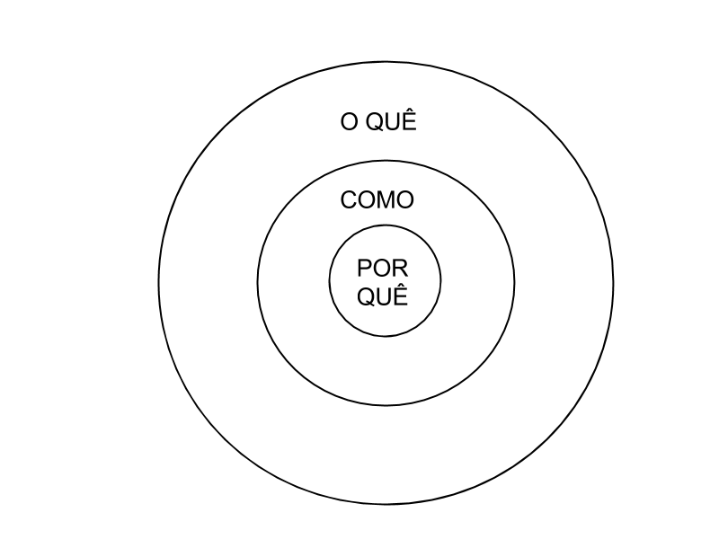

<p align="center">
  "<strong>Everyone should learn how to program a computer, because it teaches you how to think."</strong><br><br> - Steve Jobs
    <br>
  </p>

<br><br>

## English

- [Mairo Vergara](http://www.mairovergara.com/)
- [Anki](https://apps.ankiweb.net/)
- [Grammarly](https://www.grammarly.com/)
- [Audible](https://www.audible.com/)
- [Cambly](https://www.cambly.com/)
- [iTalki](https://www.italki.com/)
   
## Roadmap Software Engineering

- [<strong>Teach Yourself Programming in Ten Years - Peter Norvig</strong>](http://norvig.com/21-days.html)
- [Coding Interview University](https://github.com/jwasham/coding-interview-university)
- [Teach Yourself CS](https://teachyourselfcs.com/)
- [Web Developer Roadmap](https://github.com/kamranahmedse/developer-roadmap)
- [CS50 Harvard](https://www.youtube.com/user/cs50tv/videos)
- [wiki.icmc.usp.br](http://wiki.icmc.usp.br/index.php/P%C3%A1gina_principal_CoteiaWIKI)
- [edx.org/computer-science](https://www.edx.org/course/subject/computer-science)
- [coursera.org/algorithms](https://pt.coursera.org/courses?query=algorithms)
- [Electrical Engineering and Computer Science - MIT](https://ocw.mit.edu/courses/electrical-engineering-and-computer-science/)

## What I Learned During University

 - <strong>Primeiro: que não sei nada.</strong>
 - <strong>Segundo: quanto mais eu estudo e aprendo, menos eu sei, e quanto menos eu sei, mais eu tenho vontade de saber.</strong>
 - Existem gênios sem educação formal e idiotas com doutorado.
 - Existem graduados sem emprego, e pessoas sem educação formal sábios e milionários.
 - Existem pessoas muito inteligentes mais nada sábios, e pessoas pouco inteligentes mais muito sábios. Uma pessoa inteligente resolve um problema, um sábio o previne.
 - "Para ganhar conhecimento, adicione coisas todos os dias. Para ganhar sabedoria, elimine coisas todos os dias." - Lao-Tsé
 - A vida sempre foi, é, e será extremamente injusta. Todo mundo carrega uma cruz na vida. Aprenda a lidar com isso.
 - Geralmente, pessoas muito inteligentes estão dispostas a ouvir opiniões contrárias a dela, refletir e mudar sua opinião. Se você quer saber se uma pessoa é inteligente ou não, provavelmente isso já é um bom começo.
 - O melhor professor do mundo se chama "Google" e a melhor universidade do mundo se chama "Escola da Vida".
 - Há alunos gênios que ganharão prêmios Nobel. Há excelentes alunos que serão grandes mestres na universidade. Há ótimos alunos que serão grandes profissionais. Há bons alunos que querem ter um bom emprego e qualidade de vida. E há rebeldes que querem ser donos do próprio negócio. Cada aluno estuda com um objetivo diferente. 
 - Quanto mais eu estudo assuntos do meu interesse, mais tesão eu tenho pela vida.
 - Lembre-se sempre: tudo pode piorar. Não existe opção melhor, apenas opção menos pior.
 - Estudar assuntos por hobby (como filosofia, psicologia, psicanálise, economia, história, neurociência, etc) sem pressão de vestibular ou decoreba para fazer prova, além de ser mais eficiente, gera mais interesse pelo assunto.
 - Antes de ter, você precisa ser.
 - "Não importa o ninho, se o ovo é de águia." - Abraham Lincoln
 - "Todos somos ignorantes. A diferença é que nem todo mundo ignora a mesma coisa." - Albert Einstein.
 - Gênios, loucos e crianças sempre possuem algo em comum.
 - Sempre vai existir alguém melhor ou mais inteligente que você no mundo. Sempre. Compare-se com o você do passado, e não com os outros. Se comparar com os outros é uma das piores coisas que um ser humano pode fazer na vida.
 - A melhor forma de competição, é competir com você mesmo.
 - O maior problema e a maior doença que existe na humanidade é a ignorância.
 - Meritocracia é um termo extremamente relativo, e quase sempre, não existe.
 - Burocracia e Empregadores se importam com suas notas. A vida e os clientes não. 
 - Em um mundo com informação e conhecimento abundante de fácil acesso, a questão não é mais "COMO fazer" mas "O QUE fazer".
 - Clássicos não são clássicos atoa. Clássicos são eternos. Valorize os clássicos.
 - Aprender a questionar, aprender a aprender e saber lidar com pessoas provavelmente são as melhores habilidades que um ser humano pode desenvolver.
 - O mundo da voltas. Quem está por cima hoje, pode estar por baixo amanhã. Um dia você ajuda, outro dia você precisa ser ajudado.
 - Quanto mais eu estudo tecnologia, mais tesão eu tenho por tecnologia.
 - Há pessoas que sobreviveram muito mas viveram pouco, e há pessoas que sobreviveram pouco mas viveram muito. A maioria das pessoas não vivem, apenas existem. Algumas por opção, e a maioria por falta de opção. 
 - Se você colocar a variável ser humano no meio da equação, o resultado sempre será imprevisível.
 - Julgar as pessoas apenas pelas aparências, nem sempre é o melhor caminho.
 - Ter um bilhão de perguntas na cabeça e ter consciência que você viverá sua vida toda e não conseguirá responder a maioria delas é bastante sufocante, alguns aprendem a lidar com isso, outros não. 
 - Tenha o espírito de uma criança, mas não seja infantil. A vida é muito curta para levar tudo muito a sério.
 - Todos nascem sozinhos e morrem sozinhos. Todos nascem pelados e morrem pelados. Solidão é diferente de solitude.
 - Um dia sem aprender algo novo, é um dia perdido.
 - A vida não é um mar de rosas, não seja ingênuo.
 - Conhecimento por si só não significa nada e é totalmente inútil se não aplicado na prática.
 - Existem adultos com 15 anos e crianças com 30. Idade não necessariamente significa amadurecimento.
 - Até o mais sábio dos homens já errou, erra e vai errar. Nenhum ser humano é 100% ético, justo e virtuoso 100% do tempo, é impossível.
 - Dinheiro não é um fim, mas um meio, além de ajudar a potencializar aquilo que nós já somos.
 - Existem bilhões de possibilidades, mas cada ser humano é programado para perceber só alguma delas.
 - É muito fácil julgar o palco das pessoas, quando você não conhece os bastidores delas.
 - Um rei só é um rei, porque todo seu povo concente com isso. Sem platéia não há espetáculo.
 - Se você acha que filosofia é inútil, você ainda não entendeu o que é filosofia.
 - É muito fácil julgar e desprezar uma pessoa pobre que não teve a mesma sorte, privilégios e oportunidades que você teve, quando você não precisa ficar preocupado aonde você vai morar ou com o que vai comer amanhã.
 - A vida não segue nenhuma lógica. Você pode fazer todo o "script certinho da sociedade", como ser trabalhador, honesto, humilde, bondoso, inteligente, sempre gostar de ajudar os outros, e mesmo assim a vida pode te ferrar. Tem pessoas que cuidam muito da saúde e morrem por motivos naturais com 30 anos, e outros fumam a vida toda e morrem com 100 anos. Qual a lógica disso?
 - Se você não quebrar algumas regras durante a vida, você se arrependerá no final dela.
 - Seres humanos sempre tendem a interpretar o mundo de acordo com as próprias experiências. Pessoas que conseguem se colocar no lugar dos outros são tão raras como político honesto.
 - Desde que um ser humano não prejudique de forma alguma a liberdade e a vida de outro ser humano, o conceito de certo ou errado não existem, tudo é muito relativo. Justiça, ética, virtude e moral não existem, são apenas termos criados pelo próprio ser humano. A natureza e outros animais não se importam com isso. Durante a vida, todo ser humano é influenciado por bilhões de crenças e dogmas criados por outros seres humanos, e como todos sabem, ninguém é dono da verdade absoluta. Tudo pode ser contestado. Tudo pode ser questionado.
 - Problemas e conflitos é tão essencial para a espécie homo sapiens, assim como o conceito de 'fim' é para o universo. Sem eles, ambos não existiriam.
 - Livre-Arbítrio é uma ilusão, 99% das coisas que acontecem na vida não somos nós que escolhemos ou controlamos.
 - O mundo e a sociedade não dão a mínima para o quão bom, inteligente, sábio, humilde, bondoso, esforçado ou talentoso você seja, eles só se importam com o valor que você agrega a eles. Não acredite em receitas de bolo para o sucesso.
 - Tudo na vida é uma aposta. Investir em ações é uma aposta de retornos financeiros melhores. Investir em um diploma é uma aposta de um futuro melhor. Investir em relacionamentos é uma aposta de retorno de valor e que a outra pessoa não irá te trair, etc. A vida é totalmente imprevísivel. Carpe Diem.
 - Quanto menos expectativas você tiver da vida, do mundo e das pessoas, menos decepção você terá.
 - Nem todo mundo nasceu para fazer faculdade.
 - Melhor do que passar em qualquer matéria da faculdade, é saber cuidar da própria saúde e saber dar valor para as coisas que realmente importam.
 - Se o serviço é de graça, vocẽ é o produto.
 - Uma pessoa comum consegue interpretar a realidade com 100 pontos de vista diferentes. Uma pessoa inteligente consegue interpretar a realidade com 1000 pontos de vista diferentes. E uma pessoa muito inteligente consegue interpretar a realidade com 10.000 pontos de vista diferentes.
 - Nunca compre uma vara de pescar, de quem nunca pescou um peixe.
 - Primeiro seja realista, depois otimista.
 - Existem bilhões de formas diferentes de viver, refletir e enxergar a vida.
 - A coisa mais fácil da universidade, é entrar nela.
 - Conhecimento é sobre questionar, e não responder respostas prontas.
 - Excelentes professores quase sempre são aqueles que incentivam seus alunos a serem melhores do que eles.
 - Se você saiu da universidade com menos dúvidas e perguntas do que quando você entrou, você fez algo errado.
 - Nunca tenha cabeça fechada. Pessoas simples e humildes muitas vezes nos ensinam muito mais do que gurus, mestres e doutores.
 - A única coisa que nos define, são nossas memórias e experiências. Você só é você por causa de suas memórias e experiências, sem elas, você não é você.
 - É necessário fracassar em algumas coisas na vida. Uma vida sem fracassos te tornará um fracasso.
 - A realidade é muito mais complexa do que nosso cérebro consegue interpretar. Existem bilhões de variáveis que nós nunca conseguiremos analisar.
 - Nunca idolatre ou venere outro ser humano. Nunca. Ninguém é perfeito, e ninguém deve ser endeusado. Não passamos de matéria orgânica com átomos organizados.
 - Não existe nenhuma receita de bolo de como viver. Saiba filtrar as informações e tirar suas próprias conclusões de acordo com a  sua realidade e o seu contexto.
 - Não adianta ter doutorado e não dar bom dia para o porteiro.
 - Nenhum ser humano é especial. É só estudar um pouco de Astronomia para entender isso.
 - "Não deixe a faculdade atrapalhar seus estudos".
 - "Não é a faculdade que faz o aluno, é o aluno que faz a faculdade."
 - <strong>Nunca, jamais, em hipótese alguma, acredite 100% no que outros seres humanos dizem. Aprenda a pensar por si mesmo, buscar informações em diferentes fontes, e tirar suas próprias conclusões de acordo com o seu contexto e a sua realidade. Se você acredita em 100% no que eu escrevi aqui, você é um alienado.</strong>

## Algorithms and Data Structs

 - Genius Level Book :skull: :skull: :skull: :skull: :skull: 
    - [The Art of Computer Programming - Yoda Donald E. Knuth](https://www.amazon.com.br/Computer-Programming-Volumes-1-4a-Boxed/dp/0321751043?tag=goog0ef-20&smid=A1ZZFT5FULY4LN&ascsubtag=go_1157433115_58530734048_257324212232_pla-433354953279_c_)
 - YouTube
    - [Linguagem C Programação Descomplicada](https://www.youtube.com/user/progdescomplicada/videos) :skull:
 - Sites
    - [GeeksForGeeks](https://www.geeksforgeeks.org/)
    - [AssemblyProgressivo.net](https://www.assemblyprogressivo.net/)
- Code Training
    - [Project Euler](https://projecteuler.net/)
    - [HackerRank](https://www.hackerrank.com/)
    - [Edabit](https://edabit.com)
    - [URI Online Judge](https://www.urionlinejudge.com.br/judge/en/login)
- KhanAcademy :heart: 
   - [Computer Science](https://www.khanacademy.org/computing/computer-science)
   - [Notação assintótica](https://pt.khanacademy.org/computing/computer-science/algorithms/asymptotic-notation/a/asymptotic-notation)
- Recursion :skull:
   - [O que é recursão? Teste de Mesa com Fatorial - Softblue](https://www.youtube.com/watch?v=V60g61dhKmg)
- Data Structs Visualization
   - [VisualGo](https://visualgo.net/en)
   - [University of San Francisco - CS](https://www.cs.usfca.edu/~galles/visualization/Algorithms.html)
- Big O Notation :skull: 
   - [bigocheatsheet.com](http://bigocheatsheet.com/)
   - [A coffee-break introduction to time complexity of algorithms](https://dev.to/vickylai/a-coffee-break-introduction-to-time-complexity-of-algorithms-160m?utm_source=digest_mailer&utm_medium=email&utm_campaign=digest_email)
   - O(1) Constant Time
      - Best Case Possible
      - If an algorithm has a constant time, it means that it always takes the same amount time to produce the output.
      - Example: array.pop()
   - Logarithms O(log n)
      - Preferible in most of times
      - Logarithms are the inverse of exponentiation.
      - Example: Classic Binary search algorithm -> divide-to-conquer
      - 
   - Linear time O(n)
      - Preferible in most of times
      - If an algorithm has a linear time, it means that the running time of an algorithm grows as the input size grows.
      - Example: array.forEach() sum all values
   - Linear Logarithms O(n log n)
      - Acceptable
      ```
      x = n
      while ( x > 0 ) {
        y = x
        while ( y > 0 ) {
           y = y / 2
        }
        x -= 1
      }
      ```
      - Examples: classic Quicksort, Mergesort and Heapsort  -> divide-to-conquer
   - Quadratic time O(n²) :skull:
      - Nice To Avoid
      - The running time of an algorithm is directly proportional to the square of the size of the input.
      - Example: Sum of matrizes
      ```
      for (var outer = 0; outer < elements.Count; outer++){
        for (var inner = 0; inner < elements.Count; inner++){
          ...
        }
      }
      ```
   - Exponential Time O(2^n) :skull: :skull:
      - One of the worst case possible, always try to avoid
      - Denotes an algorithm whose growth doubles with each additon to the input data set. The growth curve of an O(2N) function is exponential - starting off very shallow, then rising meteorically
      - Example: recursive calculation of Fibonacci numbers
      ```
      int Fibonacci(int number){
          if (number <= 1) return number;
          return Fibonacci(number - 2) + Fibonacci(number - 1);
      }
      ```
   - Factorial Time O(n!) :skull: :skull: :skull:
     - Worst case possible, always try to avoid
     - Extremely unperformant
     - Will execute in n factorial time per every new operation. 
     - Example: Travelling Salesman Problem
        - "Given a list of cities and the distances between each pair of cities, what is the shortest possible route that visits each city and returns to the origin city?"
   - <strong>Resume</strong>
      - 
      - 


## DO IT YOURSELF - Cultura Maker :baby: :heart: :muscle:

 - Work Hard, Make Things, Have Fun & Make History
   - [RaspberryPi](https://www.raspberrypi.org/homepage-9df4b/)
      - [Noobs - Beginners should start with NOOBS – New Out Of the Box Software](https://www.raspberrypi.org/downloads/noobs/)
      - [MagPi Ebooks](https://www.raspberrypi.org/magpi-issues/)
      - [Lakka](https://www.lakka.tv/)
      - [RetroPie](https://retropie.org.uk/)
   - [Embarcados](https://www.embarcados.com.br/)
      - [Arduino](https://www.arduino.cc/)
         - [Manual Maker | Manual do Mundo - YouTube PlayList](https://www.youtube.com/watch?v=gcBN4NLqz_U&list=PLYjrJH3e_wDNLUTN32WittrpBxeleEqNp)
         - [create.arduino.cc - IDE Online](https://create.arduino.cc/)
         - [Tinkercard - Arduino Online](https://www.tinkercad.com/)
         - [Brasilino](https://otacilion.github.io/Brasilino/)
            - Uma biblioteca que permite programar em linguagem Arduino utilizando comandos facilitados em PT-BR.
      - [Hackster](https://www.hackster.io/)
   - [Portugol](http://lite.acad.univali.br/portugol/)
   - [MIT Scratch](https://scratch.mit.edu/projects/editor/) :video_game:
   - [Pico8](https://www.lexaloffle.com/pico-8.php) :video_game:
      - [NerdyTeachers](https://nerdyteachers.com/)
      - [NerdTeachers YouTube](https://www.youtube.com/channel/UCbMjF_cWciuBUZjILNL1fyA)
   - Internet Of Things
      - [Home-Assistant](https://www.home-assistant.io/)
      - [MQTT](https://mqtt.org/)
      - [Blynk.io](https://blynk.io/)
   - Code Online Having Fun :video_game:
      - [CodeCombat](https://codecombat.com/) 
      - [Code.org](https://code.org/)
      - [CodeMonkey](https://www.playcodemonkey.com/)
   - Cartoons
      - [MonkeyUser](https://www.monkeyuser.com/)
      - [VidaDeProgramador](https://vidadeprogramador.com.br/)
      - [VidaDeHipster](https://www.vidadehipster.com.br/)
   - <strong>Onde Comprar?</strong>
      - [FilipeFlop](https://www.filipeflop.com) :muscle:
      - [Robocore](https://www.robocore.net)
      - [VidaDeSilicio](https://www.vidadesilicio.com.br/)
      - [Arducore](https://www.arducore.com.br/)


## [Unix](https://pt.wikipedia.org/wiki/Unix)

 - [Linux](https://www.linuxfoundation.org/)
    - Sites
       - [IEEE.org](https://www.ieee.org/)
       - [Guia Foca](http://www.guiafoca.org/?page_id=51)
       - [SS64 - Commands CLI References](https://ss64.com/)
       - [Kernel.org](https://www.kernel.org/)
       - [Linuxize](https://linuxize.com/)
       - [Aurelio.net](https://aurelio.net/)
    - Benchmark
       - [Phoronix Test Suite](https://www.phoronix-test-suite.com/?k=downloads)
    - Funny Commands
       - $ fortune 
          - If you are demotivated, maybe this command can be useful :smile:
       - $ sl  
          - Sheldon Cooper sure likes this command :smile:
       - $ cmatrix
          - man, I'm a hacker, wait, Neo it's you? :smile:
       - $ cowsay "I'm Awesome!"
          - Wait, what is a cow doing here? :smile:
       - $ xcowsay "I'm More Awesome!"
          - Holy shit, this cow is more awesome. :smile:
       - $ espeak "phrase here"
          - I'm making contact with aliens man! :smile:
    - Apps for Learn Linux CLI Commands
       - [Linux Command Library](https://play.google.com/store/apps/details?id=com.inspiredandroid.linuxcommandbibliotheca&hl=en&rdid=com.inspiredandroid.linuxcommandbibliotheca)
    - YoTube
       - [Diolinux](https://www.youtube.com/user/Diolinux) :muscle:
       - [Toca do Tux](https://www.youtube.com/channel/UCkATW9o8m4pnXAAmac2o63Q)
       - [Curso de Linux Básico / Certificação LPIC1 - Bóson Treinamentos](https://www.youtube.com/watch?v=u16ZDPcf8Rc&list=PLucm8g_ezqNp92MmkF9p_cj4yhT-fCTl7)
    - Tools
       - [LinSSID Wifi Inspector](https://www.edivaldobrito.com.br/instale-linssid-um-escaner-de-redes-wireles-para-linux-com-interface-grafica/)
       - [AnyDesk](https://anydesk.com)
       - [VirtualBox](https://www.virtualbox.org/wiki/Downloads)
       - [Etcher - Flash OS images to SD cards & USB drives](https://etcher.io/)
       - [YUMI – Multiboot USB Creator](https://www.pendrivelinux.com/yumi-multiboot-usb-creator/)
       - [WineHQ](https://www.winehq.org/)
       - [Vim Para Noobs](https://woliveiras.com.br/vimparanoobs/)
    - Games :video_game:
       - [Lutris](https://lutris.net/)
       - [ZNES](http://www.zsnes.com/)
       - [PlayOnLinux](https://www.playonlinux.com/en/)
    - Currently Operation System
       - [<strong>Lubuntu 18.04 LTS (Bionic Beaver) :heart: </strong>](https://lubuntu.net/)
 - FreeBSD
    - Sites
       - [Documentation PT-BR](https://www.freebsd.org/doc/pt_BR.ISO8859-1/)
    - Books
       - [FreeBSD: O Poder dos Servidores em Suas Mãos - 2 Edição](https://www.amazon.com.br/FreeBSD-Poder-Servidores-Suas-M%C3%A3os-ebook/dp/B00FFZOE8Y)

## Microsoft Windows

 - Sites
    - [Baboo](https://www.baboo.com.br/)
    - [Baboo Cursos](https://www.baboocursos.com.br/)
 - Tools
    - [Cmder](http://cmder.net/)
    - [Rufus.ie for Windows](https://rufus.ie)
    - [Xorris Wifi Inspector](https://www.riverbed.com/products/xirrus/inspector.html)

## Security 

 - Sites
    - [OWASP](https://www.owasp.org/index.php/Main_Page)
    - [EUGDPR.org](https://eugdpr.org/)
    - [LGPD - Lei Geral de Proteção de Dados Pessoais](http://www.planalto.gov.br/ccivil_03/_Ato2015-2018/2018/Lei/L13709.htm)
    - [Haveibeenpwned](https://haveibeenpwned.com/)
    - [Livro - Fundamentos de Engenharia Reversa - Mente Binária](https://mentebinaria.gitbook.io/engenharia-reversa/antes-de-comecar)
    - [Forum CaveiraTech](https://caveiratech.com/forum/)
    - [Oauth2](https://oauth.net/2/)
    - [Practical Cryptography for Developers - Free Book](https://cryptobook.nakov.com/)
 - YouTube
    - [Gabriel Pato](https://www.youtube.com/channel/UC70YG2WHVxlOJRng4v-CIFQ)
    - [CaveiraTech](https://www.youtube.com/user/caveiratech2/playlists)
    - [Curso de Engenharia Reversa Online - Papo Binário](https://www.youtube.com/watch?v=IkUfXfnnKH4&list=PLIfZMtpPYFP6zLKlnyAeWY1I85VpyshAA)
    - [Mr Robot](https://www.imdb.com/title/tt4158110/)
 - Courses 
    - [Fundamentos de Ethical Hacking - Udemy](https://www.udemy.com/fundamentos-de-ethical-hacking/learn/v4/)
    - [Solyd.com.br](https://solyd.com.br)
    - [Técnicas de Invasão](https://tecnicasdeinvasao.com/)
    - [Desenvolimento de Software Seguro - Curso Online Gratuito - ICA Instituto ](https://desenvolvimentoseguro.icainstituto.com.br/)
 - [DAT Protocol](https://www.datprotocol.com/)
    - [DatProject.org](https://datproject.org)
    - [Try Dat](https://try-dat.com/)
 - Database
    - World's Fastest Password Cracker
       - [HashCat](https://hashcat.net/hashcat/)
       - [HashKiller](https://hashkiller.co.uk/md5-decrypter.aspx)
    - Recommended Data Encryption
       - [Argon2](https://github.com/P-H-C/phc-winner-argon2)
       - [PBKDF2](https://en.wikipedia.org/wiki/PBKDF2)
       - [Scrypt](https://en.wikipedia.org/wiki/Scrypt)
       - [BCrypt](https://en.wikipedia.org/wiki/Bcrypt)
    - NOT RECOMMENDED :skull:
       - [MD5](https://pt.wikipedia.org/wiki/MD5)
       - [SHA1](https://www.thesslstore.com/blog/difference-sha-1-sha-2-sha-256-hash-algorithms/)
       - [SHA2](https://www.thesslstore.com/blog/difference-sha-1-sha-2-sha-256-hash-algorithms/)
       - [SHA256](https://www.thesslstore.com/blog/difference-sha-1-sha-2-sha-256-hash-algorithms/)
 - Tools
    - Operation Systems
       - [Kali Linux](https://www.kali.org/)
       - [Tails Linux](https://tails.boum.org/index.pt.html)
    - Virtual Machines for Pentest
       - [PentesterLab](https://www.pentesterlab.com/exercises/)
       - [PentestBox](pentestbox.org)
          - [tools.pentestbox.org](https://tools.pentestbox.org/)
    - Transport Layer Security/Secure Sockets Layer
       - [Let's Encrypt](https://letsencrypt.org/)
    - Softwares
       - [WireShark](https://www.wireshark.org/)
       - [AngryIP Scanner](https://angryip.org/)
       - [metasploit](https://www.metasploit.com/)
	   - DataBases
	      - [Exploit-DB](https://www.exploit-db.com/)
	      - [SQLMap](http://sqlmap.org/)
	   - Useful CLI Commands
	      - [$ nmap site_url](https://nmap.org/)
	      - [$ traceroute site_url](https://www.lifewire.com/traceroute-linux-command-4092586)
        - [$ nmap localhost](https://nmap.org/)
	      - [$ curl site_url](https://curl.haxx.se/)
	      - [$ whafw00f site_url](https://github.com/EnableSecurity/wafw00f)
	      - [$ ping site_url](https://www.wikiwand.com/en/Ping)
	      - [$ host site_url](https://www.computerhope.com/unix/host.htm)
	      - [$ whois site_url](https://who.is/)
	   - Browsers
	      - [DuckDuckGo](https://duckduckgo.com)
	      - [Bernes Lee Solid](https://solid.mit.edu/)
	      - [Beaker Browser](https://beakerbrowser.com)
	      - [TorProject](https://www.torproject.org/)
	         - [TheHiddenWiki](https://thehiddenwiki.org/)
          
## Functional Programming

- [Aprender Haskell será um grande bem para você](http://haskell.tailorfontela.com.br/)

## Open Source
 
 - Sites
    - [OpenSource.org](https://opensource.org/)
    - [OpenSource.guide](https://opensource.guide/)
    - [Creative Commons](https://creativecommons.org/)
    - [Scrum Poker Online](https://scrumpoker.online/)

## Online Courses

- [Udemy - Courses I'm enrolled](https://www.udemy.com/user/alex-galhardo-vieira/)
- [Coursera - Learning How to Learn: Powerful Mental Tools to Help You Master Tough Subjects](https://www.coursera.org/learn/learning-how-to-learn)
- [Stanford - Designing Your Life & Carrer](https://lagunita.stanford.edu/courses/course-v1:Engineering+DYL+Ongoing/course/)

## Podcasts

 - [GooglePodcast](https://play.google.com/store/apps/details?id=com.google.android.apps.podcasts&hl=pt_BR)
 - Technology etc
    - Portuguese
       - [Dev Na Estrada](https://devnaestrada.com.br/)
       - [HipsterTech](https://hipsters.tech/)
       - [NerdTech](https://www.alura.com.br/podcast-nerdtech)
       - [LoopMatinal](http://www.loopmatinal.com/)
       - [Syntax](https://syntax.fm/)
       - [Sinapse](https://anchor.fm/sinapse)
       - [DataBase Cast](http://databasecast.com.br/wp/)
       - [Podprogramar](https://mundopodcast.com.br/podprogramar/)
       - [SudoCast](https://github.com/sudocast)
       - [OneBitCode](https://onebitcode.com/category/podcast/)
       - [QuebraDev](http://quebradev.com.br/)
       - [Zofe](https://zofe.com.br/)
       - [Castalio](https://castalio.info/)
       - [ElementCast](https://elemencast.github.io/#/episodios/6)
       - [Egermano](https://anchor.fm/egermano)
       - [Revolution](https://www.youtube.com/channel/UCRmG9ZyWxUenzxfoyatqp3A)
       - [SciCast](http://www.deviante.com.br/podcasts/scicast/)
       - [MeiaLua](http://www.deviante.com.br/podcasts/meialua/)
       - [Miçangas](http://www.deviante.com.br/podcasts/micangas/)
       - [TecnoCast](https://tecnoblog.net/categoria/podcast/)
       - [TricoTech](http://www.trico-tech.com/)
       - [GGDevCast](https://ggdevcast.com.br/)
       - [Por Trás dos Controles](https://www.radio.ufscar.br/shows/por-tras-dos-controles/)
       - [PixelsInk](https://www.cgmagonline.com/media/podcasts/pixels-ink/)
       - [DragoesDeGaragem](http://dragoesdegaragem.com/)
       - [Reloading](http://reloading.com.br/)
       - [RPGGuaxa](http://www.deviante.com.br/podcasts/rpguaxa/)
    - English
       - [CodeNewbie](https://www.codenewbie.org/)
       - [ShopTalk Show](https://shoptalkshow.com/)
       - [Learn To Code With Me](https://learntocodewith.me/podcast/)
       - [DeveloperTea](https://spec.fm/podcasts/developer-tea)
       - [Indie Hackers Podcast](https://www.indiehackers.com/podcast)
       - [FreeCodeCamp](https://freecodecamp.libsyn.com/)
       - [This Developers Life](http://thisdeveloperslife.com)
       - [CodingBlocks](https://www.codingblocks.net/)
       - [Changelog](https://changelog.com/podcast)
       - [FZDPodcast](http://fzdpodcast.com/)
       - [Programming Throwdown](https://www.programmingthrowdown.com/)
       - [Software Engineering Radio](http://www.se-radio.net/)
       - [GeekSpeak](https://geekspeak.org/)
       - [DevChat.TV](https://devchat.tv/)
       - [JavaScript Jabber](https://devchat.tv/js-jabber/)
       - [FullStack Radio](http://www.fullstackradio.com/)
       - [Twit.TV](https://www.twit.tv/)
       - [This Week In Tech](https://www.twit.tv/shows/this-week-in-tech)
       - [Security Now](https://www.twit.tv/shows/security-now)
       - [Floss Weekly](https://www.twit.tv/shows/floss-weekly)
       - [The Knowledge Project](https://fs.blog/the-knowledge-project/)
 - Entrepreneurship etc
    - Portuguese
       - [GVCast](https://geracaodevalor.com/gvcast/)
       - [Heroes 12 minutos](https://soundcloud.com/heroes-12min-podcast)
       - [Like a Boss](https://www.likeaboss.com.br/)
       - [Decrepitos](https://decrepitos.com/)
       - [CarreiraSemFronteiras](https://www.carreirasemfronteiras.com.br)
       - [GunCast](https://blog.keeplearning.school/guncast)
       - [NerdCast](https://jovemnerd.com.br/nerdcast)
       - [PapriCast](http://paprica.org/categoria/papricast/)
       - [B9 Podcasts](https://www.b9.com.br/podcasts/)
       - [ResumoCast](https://www.resumocast.com.br/)
       - [AntiCast](http://anticast.com.br/)
       - [ChutandoAEscada](https://chutandoaescada.com.br/)
       - [DicasCurtas](https://dicascurtas.com.br/)
       - [EscribaCafe](https://escribacafe.com/tagged/podcast)
    - English
       - [Tim Ferris Podcast](https://tim.blog/podcast/)
       - [Masters Of Scale](https://mastersofscale.com/)
       - [Rework.FM](https://rework.fm/)
       - [MadeYouThinkPodcast](https://madeyouthinkpodcast.com/)

## Bussiness

 - [@coachdefracassos](https://www.instagram.com/coachdefracassos/?hl=pt-br)
 - [@startupdareal](https://twitter.com/startupdareal)
 - “Não faz sentido contratar pessoas inteligentes e dizer a elas o que elas devem fazer; nós contratamos pessoas inteligentes para que elas possam nos dizer o que fazer”. - Steve Jobs
 - <strong>"As pessoas não compram o que você faz, elas compram o por que você faz."</strong> – Simon Sinek
 - 

## Software Engineering Principles

 - [Adams Óbvio](https://www.amazon.com/dp/8562409189?tag=bizzi0d-20)
 - "Bad software that adds value > best software in the world that does not add value"
 - "Learn to say: I DONT KNOW"
 - "Premature Optimization: the Root of All Evil"
 - "Remember that dinosaurs are almost always the best references"
 - "Who thinks little, make more mistakes"
 - "In God we trust; All others must bring data"
 - "Lack of money is the root of all evil"
 - "Doesn't exist silver bullet"
 - "Make it Work > Make it Correct"
 - "Increase Revenue > Lower Costs"
 - "SaaS > PaaS > IaaS > In-House"
 - "You != Unicorn"
 - "Always try to understand what is happening under the hoods"
 - "Write code != programming != software engineering"
 - "Maintainability > Performance"
 - "No Metrics, No Optimization"
 - "NEVER Stop Questioning"
 - "Software engineering is 80% thinking ABOUT the problem, and 20% thinking HOW to solve the problem"
 - "The more knowledge you have, the less you know. Ego = 1 / knowledge"
 - "Everyone should care about the quality"
 - "99% of good software code has been thrown away"
 - "2 + 2 is not 5, no matter how many people say it"
 - "Principles > Analogy"
 - "Talk and learn from people smarter than you"
 - "Always try to use Single Source of Truth"
 - "Do not reinvent the wheel"
 - "It is always good to study a tool deeply before using it in production"
 - "Modularization is everything"
 - "Good artists copy, great artists steal"
 - "Innovation only exists in a world of restraint and not of abundance"
 - "Always will have something to improve, done is better than perfect"


## YouTube #StopWatchingTV

 - Technology 🤖
    - [Curso em Video](https://www.youtube.com/user/cursosemvideo) :heart: :muscle:
    - [Fabio Akita](https://www.youtube.com/channel/UCib793mnUOhWymCh2VJKplQ)
    - [EstudoNauta](https://www.youtube.com/channel/UCJcWQ9MgPlHIFMx8uDWEYNg)
    - [Fábrica de Noobs](https://www.youtube.com/channel/UCGObNjkNjo1OUPLlm8BTb3A)
    - [Hipsters.Tube](https://hipsters.tech/category/hipsters-ponto-tube/)
    - [COD3R CURSOS](https://www.youtube.com/channel/UCcMcmtNSSQECjKsJA1XH5MQ/featured)
    - [CodigoFonte TV](https://www.youtube.com/user/codigofontetv)
    - [BrasilJS](https://www.youtube.com/user/BrazilJS)
    - [RemoteFirst.com.br](https://www.remotefirst.com.br)
    - [NICbrvideos](https://www.youtube.com/user/NICbrvideos/videos)
    - [FreeCodeCamp](https://www.youtube.com/channel/UC8butISFwT-Wl7EV0hUK0BQ)
    - [Papo Binário](https://www.youtube.com/channel/UCuQ8zW9VmVyml7KytSqJDzg)
    - [Baboo](https://www.youtube.com/user/baboo/videos)
    - [CodellabCode](https://www.youtube.com/channel/UCVheRLgrk7bOAByaQ0IVolg)
    - [CanalTech](https://www.youtube.com/user/canaltechbr)
    - [Bruno Germano](https://www.youtube.com/channel/UCBWbWViVqDHckknir8PIIdg/videos)
    - [Brincando com Ideias](https://www.youtube.com/channel/UCcGk83PAQ5aGR7IVlD_cBaw)
    - [O Universo da Programação](https://www.youtube.com/channel/UCWrqsnPLl6aRX0ECUmPaZEw)
    - [UNIVESPTV](https://www.youtube.com/user/univesptv/playlists)
    - [ExplainingComputers](https://www.youtube.com/user/explainingcomputers)
    - [Engenharia Reversa](https://www.youtube.com/channel/UCagV1LuB6C52fFtZwVywZYg)
    - [TheHardwareShow](https://www.youtube.com/channel/UCiXDLhXSFZdnu1OWxwGvPTw)
    - [DevNaEstrada](https://www.youtube.com/channel/UCtIygB7LtILSFWR0kxtZC-A/videos)
    - [RocketSeat](https://www.youtube.com/channel/UCSfwM5u0Kce6Cce8_S72olg/videos)
    - [Bóson Treinamentos](https://www.youtube.com/user/bosontreinamentos)
    - [Leandro Fellipe](https://www.youtube.com/user/LeandroFelipe145/featured)
    - [ProgramadorBR](https://www.youtube.com/channel/UCrdgeUeCll2QKmqmihIgKBQ)
    - [Laboratório da Júlia](https://www.youtube.com/channel/UChfu9xWITOvsXYLKm7hieSQ)
    - [Bonieky Lacerda](https://www.youtube.com/channel/UCw9mYSlqKRXI6l4vH-tAYpQ)
    - [Real Engineering](https://www.youtube.com/channel/UCR1IuLEqb6UEA_zQ81kwXfg)
    - [SoftBlue](https://www.youtube.com/user/softbluecursos)
    - [Computherpile](https://www.youtube.com/user/Computerphile)
    - [A história da Tecnologia - TecMundo](https://www.youtube.com/playlist?list=PL7cCKVGMzqmbyaouQulXxUJLdwW4qBMpp)
    - [Mayuko](https://www.youtube.com/user/hellomayuko/videos)
    - [Computer Science - CrashCourse](https://www.youtube.com/watch?v=tpIctyqH29Q&list=PL8dPuuaLjXtNlUrzyH5r6jN9ulIgZBpdo)
    - [Tecnologias do Futuro - The Enemy](https://www.youtube.com/watch?v=TLeTxzWbak8&list=PLTFO-hPawXIEYU16QavOFJvCFuruFq1Ps)
 - Talks 💭
    - [Alura Cursos Online](https://www.youtube.com/user/aluracursosonline/videos)
    - [Tedx Talks](https://www.youtube.com/channel/UCsT0YIqwnpJCM-mx7-gSA4Q)
    - [iMasters](https://www.youtube.com/user/imasters)
    - [InfoQ Brasil](https://www.youtube.com/channel/UCjiSYWQhLi9a4znW2h5pCrg)
    - [Campus Party](https://www.youtube.com/channel/UCUendDl_o6qhA7GtHxH3PTA)
    - [Futuro Descentralizado](https://www.youtube.com/channel/UCwgs6fw_BSDG5MbEivaw05g/videos)
    - [Locaweb](https://www.youtube.com/channel/UCqHIy-SOkAgNU3b-PRUL8qA)
    - [Pagar.me Talks](https://www.youtube.com/channel/UCNhSCufrcOMeFvzEM7tt9Lw)
    - [Endeavor Brasil](https://www.youtube.com/user/endeavorbrasil/videos)
 - Science 🔬
    - [Nerdologia](https://www.youtube.com/channel/UClu474HMt895mVxZdlIHXEA)
    - [SpaceToday](https://www.youtube.com/channel/UC_Fk7hHbl7vv_7K8tYqJd5A)
    - [PeixeBabel](https://www.youtube.com/channel/UCqB90BBr6eNRaJl-kl30Xxw)
    - [TED-Ed](https://www.youtube.com/channel/UCsooa4yRKGN_zEE8iknghZA)
    - [Canal do Pirula](https://www.youtube.com/user/Pirulla25)
    - [Kurzgesagt – In a Nutshell](https://www.youtube.com/user/Kurzgesagt)
    - [Vsauce](https://www.youtube.com/user/Vsauce)
    - [Physics Girl](https://www.youtube.com/channel/UC7DdEm33SyaTDtWYGO2CwdA)
    - [Science Vlogs Brasil](https://www.youtube.com/channel/UCqiD87j08pe5NYPZ-ncZw2w)
    - [PBS Space Time ](https://www.youtube.com/channel/UC7_gcs09iThXybpVgjHZ_7g/about)
    - [Ponto em Comum](https://www.youtube.com/channel/UCGo3vjM2Ll3XujL-zYT5SMg)
    - [Alimente o Cérebro](https://www.youtube.com/channel/UC3fBS89aQ7mt5G1TodU4HNg)
    - [Singularidade](https://www.youtube.com/channel/UCA6-1g_4e3iuT1qeXe6xNuA/videos)
    - [Minutos Psíquicos](https://www.youtube.com/channel/UCFiEI1kDHlO9UQtxx0wj-XA)
    - [CrashCourse Kids](https://www.youtube.com/user/crashcoursekids/videos)
    - [BigThink](https://www.youtube.com/user/bigthink)
    - [Guru Da Ciência](https://www.youtube.com/channel/UCHgK6t6Ma6m15UNO2z7YZyw)
    - [AsapSCIENCE](https://www.youtube.com/channel/UCC552Sd-3nyi_tk2BudLUzA)
    - [Ciência Todo Dia](https://www.youtube.com/user/CienciaTodoDia)
    - [Primata Falante](https://www.youtube.com/user/mrprimatafalante)
    - [Manual do Mundo](https://www.youtube.com/user/iberethenorio) 
    - [Thoughty2](https://www.youtube.com/user/Thoughty2/featured)
    - [MathGurl](https://www.youtube.com/channel/UC5RV_s1Jh-jQI4HfexEIb2Q)
    - [A Matemaníaca por Julia Jaccoud](https://www.youtube.com/channel/UCz4Zuqtj9fokXH68gZJmCdA)
    - [OrigensNT](https://www.youtube.com/watch?v=HiNR74zi8qQ&list=PLUBR4s0w2cG1kyI2MDBJV0J3B5HuJoB7g)
 - Money 💵
    - O que a escola deveria estar ensinando, mas não ensina. Lamentável.
    - [Me Poupe](https://www.youtube.com/channel/UC8mDF5mWNGE-Kpfcvnn0bUg)
    - [Gustavo Cerbasi](https://www.youtube.com/channel/UC_mSfchV-fgpPy-vuwML8_A)
    - [EconoWeek](https://www.youtube.com/channel/UCZFNY5I0RnErV23CZAd-QuQ)
    - [Canal do Por Quê?](https://www.youtube.com/channel/UCqWMwhpW-rggQZtfNXIqkrw)
    - [José Kobori](https://www.youtube.com/channel/UCOKSOW5uJHdW7Edz37mvAFw)
    - [Ricardo Amorim](https://www.youtube.com/user/RicardoAmorimMC/videos)
    - [Richard Rytenband](https://www.youtube.com/watch?v=ue-jy3-lUTk)
    - [Bruno Perini](https://www.youtube.com/channel/UCCE-jo1GvBJqyj1b287h7jA)
    - [Clube Do Valor](#)
    - <strong>Juros Compostos</strong>
       - “Os juros compostos é a maior invenção da humanidade, porque permite uma confiável e sistemática acumulação de riqueza.” - Einstein
       - M = Montante Final
       - C = Capital Inicial
       - i = Porcentagem do lucro ao mês/ano
       - n = Tempo de Aplicação (meses/anos)
       - J = Lucro líquido dado pelos juros compostos
       - M = C . (1+i)^n
       - J = M - C
       - Ex: Investir 5.000 com 0,5% de rendimento ao mês durante 12 meses
       - M = 5.000 x (1,05)^12
       - M = 5.000 x 1,7958
       - M = 8.979
       - J = 8979 - 5000 = R$ 3979
    - <strong>As Quatro Formas de Ganhar Dinheiro segundo Kiyosaki</strong>
       - Ser empregado == dedica seu conhecimento, habilidades e seu tempo para resolver os problemas de alguma empresa;
       - Ser autônomo == dedica seu conhecimento, habilidades e tempo para alguém que se interessa pelo serviço ou criando produtos próprios (livros, cursos online, etc);
       - Ser um investidor == onde você investe o dinheiro, por exemplo, na Bolsa de Valores ou em um fundo de investimento;
       - Ser dono de um negócio == onde você tem uma micro, média, grande empresa, ecommerce, etc.
       - Ativo == Tudo aquilo que gera dinheiro
       - Passivo == Tudo aquilo que tira dinheiro
       - Sempre se pague primeiro, depois os outros.
    - <strong>Warren Buffet Principles</strong>
       - Warren Buffet diz que procuramos, em geral, três coisas em uma pessoa: a inteligência, a energia e integridade. E se ela não têm essa última coisa, a integridade, não precisamos nos preocupar com as outras duas.
       - Com ou sem integridade, é mais fácil se livrar de uma pessoa que não é inteligente, do que uma pessoa inteligente.
       - Simplificando as coisas (e removendo a integridade dessa equação) teremos 4 combinações possíveis: estúpidos e trabalhadores, estúpidos e preguiçosos, inteligentes e trabalhadoras e inteligentes e preguiçosas.
       - Regra Número 1: Nunca perca dinheiro
       - Regra Número 2: Nunca esqueça a regra número 1
       - O risco vem de não saber o que você está fazendo.
       - Os investidores devem se lembrar que a excitação e os gastos são seus inimigos. E se insistirem em cronometrar a sua participação em ações, eles deveriam tentar ser medrosos quando os outros forem gananciosos e gananciosos quando os outros forem medrosos.
       - Rentabilidade passado NÃO garante rentabilidade futura.
       - Alguém está sentado na sombra hoje porque alguém plantou uma árvore há muito tempo.
       - Procurando pessoas para contratar, você busca três qualidades: integridade, inteligência, e energia. E se elas não têm a primeira, as outras duas matarão você.
       - São necessários 20 anos para construir uma reputação e apenas cinco minutos para destruí-la.
       - Por algum motivo, as pessoas se baseiam nos preços e não nos valores. Preço é o que você paga. Valor é o que você leva.
       - Se você acertou, pare de tentar.
       - Você só precisa fazer algumas poucas coisas certas na vida- desde que não faça muitas erradas.
       - Se a história passada fosse tudo o que importa no jogo, as pessoas mais ricas seriam os bibliotecários.
       - A maioria das pessoas se interessa por ações quando todo mundo está interessado. O momento de interessar-se é quando ninguém mais se interessa. Não se ganha dinheiro comprando o que é popular.
       - Não ponha dinheiro onde não entende, não aplique em empreedimentos endividados, aplique em coisas simples (pé no chão) mas que nunca deixarão de ser usadas (comida, refrigerante, aparelhos de barbear, cerveja).
    - <strong>Os 12 Axiomas de Zurique</strong>
       - 1. Preocupação não é doença, mas sinal de saúde. Se você não está preocupado, não está arriscando o bastante.
       - 2. Realize o lucro sempre cedo demais.
       - 3. Quando o barco começar a afundar, não reze. Abandone-o.
       - 4. O comportamento do ser humano não é previsível. Desconfie de quem afirmar que conhece uma nesga que seja do futuro.
       - 5. Até começar a parecer ordem, o caos não é perigoso.
       - 6. Evite lançar raízes. Elas tolhem seus movimentos.
       - 7. Só se pode confiar num palpite que possa ser explicado.
       - 8. É improvável que entre os desígnios de Deus para o Universo se inclua o de fazer você ficar rico.
       - 9. Otimismo significa esperar o melhor, mas confiança significa saber como se lidará com o pior. Jamais faça uma jogada por otimismo apenas.
       - 10. Fuja da opinião da maioria. Provavelmente está errada.
       - 11. Se não deu certo da primeira vez, esqueça.
       - 12. Planejamentos a longo prazo geram a perigosa crença de que o futuro está sob controle. É importante jamais levar muito a sério os seus planos a longo prazo, nem os de quem quer que seja.
 - Self Development & Philosophy & Psychology & History & Others 🤔
    - [NeuroVox](https://www.youtube.com/user/NeuroVoxConsultoria)
    - [Canal Nostalgia](https://www.youtube.com/user/fecastanhari)
    - [Casa do Saber](https://www.youtube.com/channel/UCtvvTFp0XANyllOdmzZr9VQ)
    - [Moporã](https://www.youtube.com/channel/UCZYCNT6OT4_cgt-ldtwGQJw)
    - [Arata Academy](https://www.youtube.com/channel/UCEdgNBcBybRtwv836C8El4g)
    - [MOVA](https://www.youtube.com/channel/UCTw4_Y7XXuorDLN5fdDWeIQ)
    - [Jacob Petry](https://www.youtube.com/channel/UCv79O7v-AHomNC7MB7cx6BA)
    - [Augusto Ollivieri](https://www.youtube.com/channel/UCfkmlovZdEmMzTsGwatkoIw)
    - [IlustradaMente](https://www.youtube.com/channel/UCNmO5NWNLQkOr76WmHEq-DQ)
    - [Quebrando a Caixa](https://www.youtube.com/channel/UC-aLWCrfZTK0_P4KRe9dQZw)
    - [PhilosTV](https://philos.tv/)
    - [Wisecrack](https://www.youtube.com/channel/UC6-ymYjG0SU0jUWnWh9ZzEQ)
    - [The School Of Life](https://www.youtube.com/channel/UC7IcJI8PUf5Z3zKxnZvTBog)
    - [Gilberto de Souza](https://www.youtube.com/channel/UCMMbl7Tt6Zy5Ho3W2bw0BfQ)
    - [Democracia na Teia](https://www.youtube.com/channel/UCvAuRF1LpthT-MNS1qKOzTQ)
    - [The History Channel Brasil](https://www.youtube.com/watch?v=6bvc8TgeGUA)
    - [Canal do Moscoso](https://www.youtube.com/channel/UChVeSyoB200ALDpnTr1TOrg/videos)
    - [Elegante](https://www.youtube.com/channel/UCwqDUiw5ut1d6glseGzH13A)
    - [reVisão](https://www.youtube.com/channel/UCiNq4OzZBFmlmERJrZdOHig/featured)
    - [Roda Viva](https://www.youtube.com/channel/UCNVsZnDXOM4PodYIEgM2e4w)
    - [Antídoto](https://www.youtube.com/channel/UCMlX_MlK7s53AjQdI7uSiyQ)
    - [didatics](https://www.youtube.com/channel/UC6Qp0jm83uxJKJEbkafl35g)
    - [mimimidias](https://www.youtube.com/channel/UCg0CfiR_iKjBOYgeHps17BA)
    - [MuriloGun](https://www.youtube.com/user/murilogun/videos)
    - [Território Conhecimento](https://www.youtube.com/channel/UCLtgh-Q-yHkYjeiY7NSPieA/featured)
    - [Café Filosófico CPFL](https://www.youtube.com/channel/UCEgITwyUyDiMVBpmDibjP3g)
    - [Se Liga Nessa História](https://www.youtube.com/channel/UCKUL3EyuAEaJUYH_kib15dg)
    - [Quem Somos Nós?](https://www.youtube.com/channel/UCIj7UmUVFTFC9yXNiZoRmEg/featured)
    - [Provocações](https://www.youtube.com/channel/UCKdVW7Np-9l3CM5daYcGEAw)
    - [Ler Antes de Morrer](https://www.youtube.com/channel/UCTubbc8ei3JfOBbicSJYPfQ)
    - [Metaforando](https://www.youtube.com/channel/UCh7TUTXojlE8vRtb-EnuDzw)
    - [Canal do Por Quê?](https://www.youtube.com/channel/UCqWMwhpW-rggQZtfNXIqkrw)
    - [Meteoro Brasil](https://www.youtube.com/channel/UCk5BcU1rOy6hepflk7_q_Pw)
    - [Canal do Cortella](https://www.youtube.com/channel/UCyTS929PXJSUiBEFSzdypgg)
    - [Luiz Felipe Pondé](https://www.youtube.com/channel/UCW9jLtlONRp7W-AK9F8M66Q)
    - [NOVA ACRÓPOLE - Escola Internacional de Filosofia](https://www.youtube.com/channel/UCAMO_xP86YB4FSHD1Mi_GpA)
    - [Ivan Maia](https://www.youtube.com/channel/UCV2PX_XxoAr6r8ukV327rtg)
    - [Prazer, Karnal](https://www.youtube.com/channel/UC4O2eKb8vI4VlMeNp90asfg)
    - [Saber Filosófico](https://www.youtube.com/channel/UCWdXgfpEIZIGzah9_yCL-Xw)
    - [Seja Uma Pessoa Melhor](https://www.youtube.com/channel/UCbG7_Agdb99rhG9-rhY8iTg/videos)
    - [Jordan Peterson](https://www.youtube.com/user/JordanPetersonVideos)
       - REGRA 1 – Costas eretas e ombros para trás
       - REGRA 2 – Cuide de si mesmo como cuidaria de alguém sob sua responsabilidade
       - REGRA 3 – Seja amigo de pessoas que queiram o melhor para você
       - REGRA 4 – Compare a si mesmo com quem você foi ontem, não com quem outra pessoa é hoje
       - REGRA 5 – Não deixe que seus filhos façam algo que faça você deixar de gostar deles
       - REGRA 6 – Deixe sua casa em perfeita ordem antes de criticar o mundo
       - REGRA 7 – Busque o que é significativo, não o que é conveniente
       - REGRA 8 – Diga a verdade. Ou pelo menos, não minta. Seja sincero e aprenda a dizer não!
       - REGRA 9 – Presuma que a pessoa com quem está conversando possa saber algo que você não sabe
       - REGRA 10 – Seja preciso no que diz
       - REGRA 11 – Não incomode as crianças quando estão andando de skate
       - REGRA 12 – Acaricie um gato ao encontrar um na rua
    - <strong>10 Ideias Outliers</strong>
       - IDEIA #1: Talento é superestimado
       - IDEIA #2: Regra das 10 mil horas
       - IDEIA #3: Prática deliberada
       - IDEIA #4: Concentre-se em melhorar uma coisa de cada vez
       - IDEIA #5: Não espere ser bom quando você começar algo
       - IDEIA #6: Prepara-se para agarrar oportunidades
       - IDEIA #7: O QI não é o mais importante
       - IDEIA #8: Desenvolva sua inteligência prática.
       - IDEIA #9: Seja disciplinado!
       - IDEIA #10: O peso dos nossos legados culturais
    - <strong>Mikhail Litvak</strong>
       - Quando um homem não pode dizer nada bom sobre si mesmo, e quer dizer algo, ele começará a falar mal dos outros.
       - Agarre a ciência ao invés da garganta de uma pessoa que ama se você quiser agarrar algo.
       - Depressão foi dada ao homem para que ele pudesse pensar sobre si próprio.
       - Ninguém rejeita alguém. Ele somente segue em frente. Aquele que foi deixado pra trás é que se considera rejeitado.
       - Se você acredita que é uma boa pessoa, por que você precisa que alguém pense isso sobre você?
       - Faça o que quiser e não peça permissões para tal. Você não irá recebê-las.
       - Os sinais de maturidade espiritual são a habilidade de amar e a habilidade de lidar com a solidão. Nós estamos fazendo as melhores coisas enquanto sozinhos.
       - Uma pessoa imatura frequentemente sabe, mas não faz. Uma pessoa madura não somente sabe, mas faz. Assim sendo, um pessoa imatura critica e uma madura faz.
       - Eu não sei o caminho para o sucesso. Mas eu sei o caminho para o fracasso - é o desejo de ser amado por todos.
       - Não há lógica masculina ou feminina. Só há a habilidade ou inabilidade de pensar corretamente.
       - Você somente quer saber quem é o seu maior inimigo? Olhe para o espelho. Derrote ele e os outros fugirão.
       - Conquiste o sucesso - os insultos passarão.
       - É legal conversar com os amigos. É útil conversar com os inimigos.
       - Só há uma razão para abandonar seu trabalho ou acabar com um relacionamento - a inabilidade de atingir o crescimento pessoal nas dadas circunstâncias.
       - Você deve compartilhar apenas alegria com amigos e inimigos. Seus amigos ficarão felizes e seus inimigos, chateados.
       - Não corra atrás da felicidade e você irá encontrar um lugar feliz. Eu posso contá-lo o lugar em que a felicidade está - em você. A estrada para a felicidade é o máximo desenvolvimento de todas as suas habilidades.
       - Felicidade é um produto de uma vida bem organizada.
       - Se você quer provar algo a alguém, você existe apenas para aquela pessoa. Se você existe para si, então não precisa provar nada a ninguém.
       - Imaginação - a voz de todas as suas habilidades. Dessa forma, eu não sonho em cantar opera. Eu não tenho a voz pra isso. E se eu sonhar com isso, eu estaria desencadeando minhas habilidades. Então, eu estaria fazendo qualquer coisa para me tornar parte do canto de ópera. Você apenas deve pensar em tornar seu sonho realidade. Não corra - é assim que os sonhos se tornam realidade mais rapidamente. É bom quando um homem diz - eu estou somente tentando fazer os meus sonhos tornaram-se realidade.
       - É melhor se comunicar com um bom livro do que com uma pessoa vazia.
       - Se as suas ações forem bem planejadas, a felicidade acontecerá naturalmente.
       - Se você quiser sonhar, fantasie sobre coisas realistas e objetivos que podem ser atingidos. Dessa maneira, você não perderá a sua direção.
       - Ao invés de ficar perto de uma pessoa que não lhe acrescenta nada, apenas para ter alguém do lado, compre um livro. Ele será uma melhor companhia e o manterá mais entretido.
       - Uma pessoa que não consegue ser feliz consigo mesma sempre vai tentar ferir aqueles ao seu redor. E exatamente por isso nunca tem sobre o que conversar.
       - Se você está solitário, principalmente após o fim de um relacionamento, significa que está amadurecendo e crescendo espiritualmente. Além disso, estar solitário pode aumentar nossa produtividade.
       - O caminho correto nem sempre é o mais curto
       - Se você não fizer nada por você mesmo, como você pode querer ajuda?
    - <strong>4 Passos da Competência</strong>
       - 1 - Inconscientemente incompetente: "você não sabe o quanto você não sabe"
       - 2 - Conscientemente incompetente: "você sabe o quanto você não sabe"
       - 3 - Conscientemente competente: "você já sabe o quanto você sabe"
       - 4 - Sabedoria: "inconscientemente você não sabe o quanto você sabe"
    - <strong>As 4 Regras do Método Cartesiano</strong>
       - René Descartes, decepcionado com o ensino que lhe foi ministrado criou o método cartesiano, para assim conduzir o indivíduo a verdade indiscutível.
       - 1 -  consistia em nunca aceitar algo como verdadeiro sem conhecê-lo evidentemente como tal. Isto é, evitar cuidadosamente a precipitação e a prevenção; não incluir nos meus juízos nada que não se apresentasse tão clara e distintamente à minha inteligência a ponto de excluir qualquer possibilidade de dúvida.
       - 2 - era dividir o problema em tantas partes quantas fossem necessárias para melhor poder resolvê-lo.
       - 3 - conduzir por ordem os meus pensamentos, começando pelos objetos mais simples e mais fáceis de conhecer, para subir pouco a pouco, gradualmente, até o conhecimento dos mais compostos; e admitindo uma ordem mesmo entre aqueles que não apresentam nenhuma ligação natural entre si.
       - 4 - Por último, sempre fazer enumerações tão completas, e revisões tão gerais, que tivesse certeza de nada ter omitido.
    - <strong>Poder Além da Vida</strong>
       - 3 Regras de Sócrates:
          - PARADOXO: A vida é um mistério. Não perca tempo tentando entendê-la.
          - HUMOR: Tenha senso de humor. Especialmente sobre si mesmo. É a força por trás de toda atitude.
          - MUDANÇA: Nada permanece o mesmo.
       - A felicidade está na jornada, e não no destino.
       - O lixo está na sua cabeça. Primeiro precisar retirar o que não precisa.
       - "Você é maluco, sabia?" "Leva-se uma vida inteira praticando."
       - A primeira percepção do guerreiro: que ele não sabe.
       - É natural ter emoções. Como as nuvens que passam.
       - Sempre há algo acontecendo. Nada na vida é banal.
       - O medo e não o dinheiro é a raiz de todo mal.
       - Quem tem dificuldade de amar é quem mais precisa de amor.
       - Não existe certo. Ninguém está certo. Assim como você nunca está mais errado do que os outros.
       - A morte não é triste. Não existe tristeza na morte. O triste é que a maioria das pessoas não aproveita a vida!
       - Um guerreiro não desiste daquilo que ama. Ele acha o amor naquilo que faz.
       - Um guerreiro não procura a perfeição. Ou vitória. Ou invulnerabilidade. Ele é totalmente vunerável. É sua única coragem.
       - Um guerreiro age. Só um tolo reage.
       - Não existe início, nem chegada, apenas o caminho.
    - <strong>Princípios "Você Não É Tão Esperto Quanto Pensa"</strong>
       - O Experimentos do Macacos e a escada com um cacho de banana   
          - O Equívoco: Fazemos o que fazemos pois temos consciência do que estamos fazendo.
          - A Verdade: Normalmente não fazemos a mínima ideia do que fazemos, apenas seguimos condicionamentos sociais.
       - Efeito de ancoragem  
          - O Equívoco: Você racionalmente analisa todos os fatores antes de fazer uma escolha determinante.
          - A Verdade: Sua primeira percepção permanece em sua mente, afetando percepções e decisões posteriores.
       - A Ilusão de Transparência
          - O Equívoco: Quando suas emoções vêm à tona as pessoas conseguem olhar para você e saber o que você está sentindo ou pensando.
          - A Verdade: Sua experiência subjetiva não é observável e você superestima a capacidade dos outros entender ou captarem suas emoções.
       - Extinção Forçada
          - O Equívoco: Se você parar imediatamente de manter um hábito ruim, esse hábito perderá a força até desaparecer de sua vida.
          - A Verdade: Sempre que você tenta cortar um hábito bruscamente, seu cérebro vai fazer um último esforço para retomar ao velho hábito.
       - Desindividualização ou Consciência de manada
          - O Equívoco: Pessoas que saqueiam e vandalizam em meio ao caos estavam apenas esperando uma desculpa para roubarem ou serem violentas.
          - A Verdade: Você é propenso a perder sua individualidade e ser absorvido pela "mente coletiva" dadas condições corretas.
       - Crenças Persistentes
          - O Equívoco: Quando você se depara com fatos que contradizem aquilo que você acredita, você incorpora esses fatos novos e altera suas crenças.
          - A Verdade: Quando você depara com fatos que contradizem suas crenças, você os ignora e fortalece suas crenças.
       - Tendência de Confirmação
          - O Equívoco: Suas opiniões são o resultado de anos de análise racional e objetiva.
          - A Verdade: Suas opiniões resultam do fato de você prestar atenção nas informações que confirmam suas crenças e ignorar todas as informações que contradizem aquilo que você acredita.
    - <strong>Três Tipos de Pessoas</strong>
       - As que não fazem nada. (90%)
       - As que olham as coisas acontecerem. (5%)
       - As que fazem alguma coisa. (5%)
    - <strong>3 Passos</strong>
       - Conhecimento: Só fale quando perguntado!
       - Inteligência: Escute o dobro do que fale quando perguntado!
       - Sabedoria: Fique quieto!
    - <strong>4 Filosofias de Vida</strong>
       - Ganha-Perde: eu ganho, você perde
       - Perde-Ganha: vitimismo
       - Perde-Perde: eu perco, mais você perde também
       - Ganha-Ganha: eu ganho se você ganha (teoria dos jogos)
    - <strong>Seus 3 Maiores Inimigos</strong>
       - Medo
       - Ansiedade
       - Preocupação
    - <strong>O princípio do FIM</strong>
       - Ignorância = Insegurança e Dúvida.
       - Insegurança + Dúvida = Medo.
       - Medo + Dúvida = Ansiedade.
       - Ansiedade + Medo = Preocupação.
       - Preocupação gera as Doenças.
       - Doenças gera as Mortes.
    - <strong>5 Princípios do Jornalismo</strong>
       - 1 - Princípio da Precisão.
       - 2 - Princípio da Independência.
       - 3 - Princípio da Imparcialidade.
       - 4 - Princípio Humanitário.
       - 5 - Princípio da Responsabilidade.
    - <strong>Como Tomar Melhores Decisões - Regra 10/10/10</strong>
       - 1 - Como me sentirei sobre minha decisão em 10 minutos?
       - 2 - Como me sentirei sobre minha decisão em 10 meses?
       - 3 - Como me sentirei sobre minha decisão em 10 anos? 
    - <strong>4 Tipos de Pessoas que Sempre Fracassam</strong>
       - Os indecisos.
       - Os poucos instruídos.
       - Os desatentos.
       - Os desanimados.
    - <strong>Segredo da Felicidade</strong>
       - "Mestre, qual o segredo da felicidade?" - perguntou o aprendiz.
       - "Nunca discutir com idiotas." - respondeu o mestre.
       - "Eu discordo disso." - replicou o aprendiz.
       - "Você está certo." - finalizou o mestre.
    - <strong>Mario Sergio Cortella 🤔</strong>
       - "O intolerante é, acima de tudo, covarde. Em segundo lugar, ele é tonto. Porque ele é covarde? Porque ele tem tanto medo de ser como é, que a única maneira dele provar que a maneira como ele é a única certa é desprestigiando quem não é como ele. E, por isso, é uma forma de covardia, porque ele supõe que a única maneira dele crescer é se ele abaixar outra pessoa. Isso é coisa de gente pequena, não é coisa de gente grande. Em segundo lugar, ele é tolo. Porque achar que o único modo de ser é como eu sou é não só arrogante, como é uma negação da própria realidade."
       - "Nós sempre estamos grávidos de nós mesmos."
    - <strong>Clóvis de Barros Filho 🤔</strong>
       - "O lixo da felicidade está na pretensão ilusória, mas a outra metade dela é linda: é a alegria que você não quer que acabe."
    - <strong>Luis Felipe Pondé 🤔</strong>
       - "O homem é um tipo de animal que carrega o cadáver nas costas a vida inteira, porque sabe mais do que deve, e menos do que precisa."
    - <strong>O Jeito Harvard de Ser Feliz: 7 Princípios</strong>
       - I – O benefício da felicidade
          - “Quando eu for bem sucedido, eu vou ser feliz.” - ERRADO
          - "Se eu sou feliz fazendo o que eu faço, terei sucesso." - CERTO
       - II. O ponto de apoio e alavanca
          -  Quanto mais você acredita na própria capacidade de sucesso, maiores são as suas chances de atingir esse sucesso.
       - III. O efeito Tetris
          - Algumas pessoas estão configuradas para identificar apenas padrões negativos, enquanto outros, positivos
       - IV. Encontre oportunidades na adversidade
       - V. O círculo do zorro
          - comece muito pequeno e vá aumentando.
       - VI. A regra dos 20 segundos
          - A Regra dos 20 segundos fala pra você eliminar os “cerca de 20 min” antes do novo hábito que você quer incorporar. Tire todas as barreiras antes de começar aquela atividade para deixá-la o mais fácil possível!
       - VII. Investimento social
          - rede social de apoio é o seu maior ativo.
    - <strong>7 Princípios de Leonardo da Vinci </strong>
       - <strong>1 - Curiosità</strong>: Instigue sua curiosidade: em relação à vida e uma busca contínua do conhecimento. Quando somos crianças, somos naturalmente cheios de curiosidades em relação à vida e a tudo que nos rodeia. Não deixe esta curiosidade na infância, questione tudo, busque entender o porquê das coisas, veja alguma situação por um ângulo diferente. Preste atenção nos questionamentos que você mais tem em mente; isso reflete os objetivos de sua vida como também, influenciam a qualidade de vida.
       - <strong>2 - Dimostrazione</strong>: Aprenda com a experiência: Submeta o conhecimento aos testes e experiências. Tenha perseverança e se disponha a aprender com os próprios erros. 
       - <strong>3 - Sensazione</strong>: Estimule sua percepção: Um contínuo aperfeiçoamento dos sentidos, principalmente da visão, como meio de tornar a experiência mais vívida
       - <strong>4 - Sfumato</strong>: Enfrente a sombra: Disposição para aceitar a ambiguidade, o paradoxo e a incerteza.
       - <strong>5 - Arte/Scienza</strong>: Busque o equilíbrio entre ciência e arte, lógica e imaginação: se baseia em desenvolver os dois hemisférios cerebrais: o direito, relacionado ao pensamento imaginativo, atividades artísticas e intuição. O esquerdo relacionado ao pensamento lógico e analítico. Nosso sistema educacional e a ciência tendem a não dar importância ao intelecto de natureza não verbal. O resultado disso é que os indivíduos aprendem apenas a ir bem na escola mas de modo geral, não conseguem desenvolver sua capacidade criativa. Muitas pessoas se destacam na arte mas não conseguem ir bem na escola e acabam sendo rotulados erroneamente como incapazes de aprender.
       - <strong>6 - Corporalità</strong>: Integre corpo, mente e espírito: baseia-se no princípio que devemos assumir responsabilidade por nossa saúde e bem- estar, a partir de exercícios físicos, alimentação saudável e descanso.
       - <strong>7 - Conessione</strong>: Realize a comunhão: Como todos os elementos acima se harmonizam? Como tudo se relaciona com tudo?
    - <strong>O Cavaleiro Preso na Armadura - Robert Fischer</strong>
       - "Estamos todos presos em algum tipo de  armadura." - Bolsalegre (bobo da corte)
       - "Quando da armadura você se livrar, a dor  dos outros também sentirá." - Bolsalegre
       - "Uma pessoa não pode fugir e aprender  ao mesmo tempo. Ela precisa permanecer algum tempo no mesmo lugar." - Merlin (mago)
       - "E comum as pessoas não terem  consciência do caminho que estão seguindo." - Mago
       - "Os animais aceitam e os seres  humanos têm expectativas." - Rebecca (pomba)
       - "Nós levantamos barreiras para proteger  quem pensamos ser. Então um dia  ficamos presos atrás das barreiras e não  conseguimos mais sair. " - Rei
       - "Como me conheço, posso conhecer  você. Somos todos parte um do outro." - Merlin
       - "E somente quando nos amamos que podemos amar os outros." - Mago
       - "[...] às vezes a gente não sabe quando  é hora de pedir ajuda." - Merlin
       - "[...] A  ambição  do  coração  é  pura.  Ela  não  compete  com  ninguém  e  nem fere  ninguém.  De  fato,  ela  o  serve  de  tal  maneira  que  serve  os  outros  ao mesmo tempo." - Merlin
       - "Quase morri pelas lágrimas que deixei de chorar" - Cavaleiro
    - <strong>O Tao do Jeet Kune Do - Bruce Lee</strong>
       - 1 - OBJETIVO
          - "Um objetivo nem sempre é para ser atingido, frequentemente serve apenas como algo a ser mirado."
       - 2 - FLEXIBILIDADE
          - "Limpe a sua mente e seja como a água, sem forma. Você coloca a água num copo e se torna o copo, coloca água em uma garrafa, se torna a garrafa. A água pode fluir ou colidir. Seja água, meu amigo."
       - 3 - TEMPO
          - "Se você ama a vida, não desperdice tempo, é de tempo que a vida é feita."
       - 4 - PROPÓSITO
          - "Viver de verdade é viver para os outros."
       - 5 - ACEITAÇÃO
          - "Não pense sobre quem está certo ou errado ou quem é melhor que o outro. Não seja nem a favor nem contra."
       - 6 - FOCO
          - "Eu não temo o homem que praticou 10.000 chutes diferentes, mas aquele que praticou o mesmo chute 10.000 vezes.”
       - 7 - SIMPLICIDADE
          - "Simplicidade é a chave para algo brilhante."
       - 8 - ENCONTRE O SEU CAMINHO
          - "Absorva o que lhe é útil, descarte o que não é, e adicione algo único."
       - 9 - EGO
          - "Artes-marciais são principalmente fonte de auto-conhecimento. Um soco ou um chute não é para arrancar os males do cara a sua frente, mas para arrancá-los seu próprio ego, medo e obstáculos."
       - 10 - COMECE AGIR
          - "Saber não é o suficiente, você tem que aplicar; querer não é o bastante, você tem que fazer."
    - <strong>Sêneca</strong>
       - Deve-se dar à alma algum descanso. Repousando, ela se torna mais atilada para a ação.
       - Mesmo que apenas eu saiba o que estou fazendo, agirei como se todos estivessem me vendo.
       - Convém nos afastar da pompa e medir a utilidade das coisas, e não a sua beleza exterior.
       - Talentos forçados respondem mal; Se a natureza é relutante, o trabalho é infrutífero.
       - Seguimos a nós mesmos e não conseguimos jamais nos desembaraçar de nossa própria companhia! Assim, devemos saber que o mal contra o qual trabalhamos não vem dos lugares, mas de nós mesmos.
    - <strong>Como Aprender Kung Fu 功夫</strong>
       - 1 - Kung Fu 功夫 não pode ser “ensinado”, apenas aprendido. Como aprender a andar de bicicleta.
       - 2 - Você aprende Kung Fu 功夫sem perceber que está aprendendo.
       - 3 - O Kung Fu功夫 é manifestado principalmente nas atividades do cotidiano.
       - 4 - Todas as pessoas tem condições de desenvolver o Kung Fu 功夫e cada um tem a sua própria maneira de manifestá-lo.
       - 5 - Para desenvolver o Kung Fu 功夫é preciso aprender a evolui a vontade para melhor avaliar o potencial de uma situação.
       - 6 - Quando aprendido apropriadamente, o Kung Fu 功夫 aflorará de maneira natural toda vez que for necessário.
       - 7 - O que caracteriza uma pessoa que manifesta o Kung Fu 功夫 é a capacidade de estar relaxado. Ela está aberta para aquilo que não entende e faz uso dos recursos oferecidos por tudo que está ao redor.
       - "Kung Fu se aprende sem sabermos que estamos aprendendo. É quando você se dedica à prática, mantém-se estudando e continua a aprender até você atingir um determinado nível onde o que faz é muito simples e tem significado profundo."
       - "Não pense que o resultado adquirido por outra pessoa terá o mesmo efeito em você. Por isso, não basta ir até um mestre que tenha algo bom para oferecer, adquirir um certo conhecimento técnico e ir embora. Se aprender algo assim, quando precisar empregá-la, não saberá como."
       - "Para aprender Kung Fu, você precisa senti-lo. É preciso dedicar tempo para estudá-lo. É um processo de convivência com o seu mestre. Para isso, você tem que imergir dentro do processo de aprendizado."
    - <strong>Sun Tzu - A Arte da Guerra</strong>
       - <strong>1 - Alguns exércitos não devem ser enfrentados</strong>
       - <strong>2 - 5 fatores são determinantes para o sucesso</strong>
          - Clima
          - Território
          - Comando
          - Doutrina militar
          - Influência moral
       - <strong>3 - Gerenciamento</strong>:  Você não vai querer ser pego desprevenido bem no meio de uma missão, por isso faça as contas e gerencie os gastos.
       - <strong>4  Estratégia</strong>: prega que o vencedor da guerra era o estado que conseguia a rendição do inimigo sem que houvesse um combate. Para tanto seu conselho é que o ataque seja feito primeiro sobre a estratégia dos concorrentes, em segundo sobre suas alianças e, em terceiro sobre seus soldados, oferecendo melhores oportunidades e condições de trabalho.
       - <strong>5 - Tática</strong>: Se for mais forte que seu concorrente, ataque, se for mais fraco, se defenda, mas jamais seja previsível.
       - <strong>6 - Conheça a si mesmo e aos seus oponentes</strong>: "If you know the enemy and know yourself, you need not fear the result of a hundred battles. If you know yourself but not the enemy, for every victory gained you will also suffer a defeat. If you know neither the enemy nor yourself, you will succumb in every battle."
       - <strong>7 - Deixe espaço para realizar manobras</strong>: sempre haverá imprevistos, por isso não se prenda a uma única medida ou estratégia
       - <strong>8 - Tenha uma estrutura sólida</strong>: mantenha uma estrutura que lhe favoreça retornar ainda mais forte e consistente
       - <strong>9 - Use um ataque indireto</strong>
       - <strong>10 - Considere algumas razões de ataques estratégicos</strong>
          - Nunca ataque quando estiver por baixo: Certifique-se de que está a uma altura segura de modo que não seja alcançado depois de conceber o ataque.
          - Nunca ataque em terreno desconhecido: Avalie e estude o território de ataque para que a luta não seja desperdiçada. Alguns territórios não valem à pena ser conquistados.
          - Proteja-se em terrenos perigosos: Observe a maneira mais segura de atacar em território perigoso, protegendo-se, esquivando-se e garantindo um plano de fuga. Se tudo der errado, que atitude deverá tomar?
       - <strong>11 - Quando não houver alternativa, arrisque</strong>: quando já não há alternativas a melhor estratégia é arriscar. Quando estamos diante de um grande perigo, fazemos o impossível para superar os desafios e prosperar.
       - <strong>12 - Considere estes nove fatores previsíveis</strong>:  dispersivo, marginal, contencioso, aberto, convergente, difícil, crítico, cercado e desesperado.
       - <strong>13 - Conte com esta categoria de espiões para triunfar sobre o oponente no mercado</strong>
          - Espiões nativos: São os próprios criadores da empresa, sócios e investidores.
          - Espiões internos: Funcionários da empresa concorrente.
          - Espiões convertidos: São os espiões do inimigo que fornecem informações.
          - Espiões descartáveis: São espiões convertidos pelo inimigo.
          - Espiões indispensáveis: São aqueles que possuem respeito com o inimigo e fornecem informações confiáveis.
    - <strong>9 Mandamentos do Livro dos 5 Anéis - Miyamoto Musashi</strong>
       - 1 – Não faça nada desonestamente, evitar todo e qualquer pensamento perverso.
       - 2 – O Caminho está no treino.
       - 3 – Familiarize-se com todas as artes.
       - 4 – Compreender os mandamentos de todas as profissões.
       - 5 – Saiba distinguir entre vantagens e desvantagens em assuntos mundanos.
       - 6 – Desenvolva julgamento intuitivo e entendimento para tudo.
       - 7 – Perceba todas as coisas que não podem ser vistas.
       - 8 – Preste atenção aos menores detalhes.
       - 9 – Não faça nada que não tenha qualquer utilidade.
       - <strong>Outros Princípios</strong>
       - 1. Aceite tudo do jeito que é.
       - 2. Não procure prazer pelo seu próprio bem.
       - 3. Não, em hipótese alguma, dependa de um sentimento parcial.
       - 4. Pense levemente em si mesmo e profundamente do mundo.
       - 5. Seja desapegado do desejo por toda a sua vida.
       - 6. Não se arrependa do que você fez.
       - 7. Nunca seja ciumento.
       - 8. Nunca deixe-se entristecer por uma separação.
       - 9. O ressentimento e a queixa não são apropriados nem para si nem para os outros.
       - 10. Não se deixe guiar pelo sentimento de luxúria ou amor.
       - 11. Em todas as coisas não tem preferências.
       - 12. Seja indiferente aonde você mora.
       - 13. Não persiga o sabor da boa comida.
       - 14. Não segure as posses que você não precisa mais.
       - 15. Não aja seguindo as crenças costumeiras.
       - 16. Não colete armas ou pratique com armas além do que é útil.
       - 17. Não tenha medo da morte.
       - 18. Não procure possuir bens ou feudos para a sua velhice.
       - 19. Respeite o Buda e os deuses sem contar com a ajuda deles.
       - 20. Você pode abandonar seu próprio corpo, mas deve preservar sua honra.
       - 21. Nunca se desvie do caminho.
    - <strong>Diferença entre Conhecimento e Informação</strong>
       - Informação: acumulativa
       - Conhecimento: seletiva
    - <strong>Como Fazer Amigos e Influenciar Pessoas - Dale Carnegie</strong>
       - IDEIA  1: Lembre-se que o nome de uma pessoa é para ela o som mais doce e importante que existe em qualquer idioma
       - IDEIA  2: Fale de coisas que interessam à outra pessoa
       - IDEIA  3: Torne-se verdadeiramente interessado na outra pessoa
          - “Você pode fazer mais amigos em dois meses, tornando-se interessado em outras pessoas do que você pode em dois anos, tentando fazer com que outras pessoas se interessem por você” 
       - IDEIA  4: Sorria 
          - “Um homem sem uma fisionomia sorrindo não deve abrir uma loja” – provérbio chinês
       - IDEIA 5: Faça a outra pessoa sentir-se importante e faço-o com sinceridade
          - Distribua elogios sinceros no seu dia a dia. Não bajule!
       -  IDEIA  6: Seja um bom ouvinte; incentive as pessoas a falarem sobre elas mesmas. 
          - A cada três frases, uma é em 1ª pessoa. Procure saber pelo menos 3 coisas sobre a vida das pessoas que você conhece.
          - “O homem que pensa somente em si é irremediavelmente ignorante. Não é educado, não interessando o grau de instrução” 
       -  IDEIA 7: Mostre respeito pela opinião dos outros. Nunca diga você está errado! 
          - Se você estiver falando com alguém que você SABE que está errado, você pode falar algo do tipo: Bem, olhe, pensei o contrário, mas eu posso estar errado, como frequentemente estou. E se eu estiver errado, eu quero ser corrigido. Vamos examinar os fatos. 
       - IDEIA  8: Dramatize suas ideias
       - IDEIA  9: Se você estiver errado, admita rapidamente.
          - Engula o orgulho e admita seu erro – é a melhor saída
       - IDEIA 10: Chame atenção indiretamente
          - Como dar um feedback: substitua o “MAS” dos seus feedbacks por “E”.
    - <strong>Diferença entre Objetivo e Meta</strong>
       - O objetivo é apenas uma vaga ideia daquilo que queremos. É o seu ponto de partida rumo a algo que você gostaria de ter, ser ou viver. Ou seja, a sua motivação.
          - "você se contenta em definir o objetivo, que é o que geralmente fazemos. Mas esquece de especificar a meta."
          - <strong>Portando OBJETIVO =  A descrição do seu desejo.</strong>
       - Meta nada mais é quem um objetivo com ações bem definidas.
          - Saiba que pessoas que escrevem suas metas tem 50% mais chances de realizá-las do que aqueles que não escrevem metas.
       - Daniel Pink, autor do livro Drive, sobre motivação, identificou três fatores-chave:
          - Autonomia: Nosso desejo de viver a vida que desejamos. Nossa vontade de ter a liberdade para fazer o que preferimos.
          - Maestria: Nosso senso de urgência para ser melhor em diversos sentidos, tanto profissional como pessoal.
          - Propósito: Nossa missão de vida. A intenção de fazer uma diferença no mundo, mesmo que relativamente pequena.
       - Meta SMART
          - S = Especific
             - O que exatamente (mais detalhes possíveis) você quer conquistar?
             - Onde?
             - Você precisará da ajuda de outras pessoas? Quais pessoas?
             - Existe uma alternativa para essa meta SMART que desejo alcançar que traria o mesmo grau de satisfação?
             - Do que você não abre mão para conquistar essa meta?
             - Quais são as suas limitações para conquistar essa meta?
             - Quais são as condições obrigatórias para conquistar essa meta?
          - M = Mensurable
             - Quais são os resultados mensais esperados?
             - Quanto tempo de dedicação será necessário para alcançar a meta?
          - A = Attainable
             - "Quem já esteve na Lua já não tem mais metas na Terra." - Edwin Aldrin
          - R = Relevant
             - Refletir se isso é relevante na sua vida.
          - T = Time-Related
             - Colocar datas realistas
        - Exemplo de meta SMART: Eu vou ler 24 livros de desenvolvimento pessoal nos próximos 12 meses.
        - Um dos maiores segredos para o sucesso é a disciplina, a constância e a paciência.
    - <strong>Poema Mude de Edson Marques</strong>
       - Mude, mas comece devagar, 
       - porque a direção é mais importante que a velocidade. 
       - Mude de caminho, ande por outras ruas, 
       - observando os lugares por onde você passa. 
       - Veja o mundo de outras perspectivas. 
       - Descubra novos horizontes.
       - Não faça do hábito um estilo de vida.
       - Ame a novidade. 
       - Tente o novo todo dia. 
       - O novo lado, o novo método, o novo sabor, 
       - o novo jeito, o novo prazer, o novo amor. 
       - Busque novos amigos, tente novos amores. 
       - Faça novas relações. 
       - Experimente a gostosura da surpresa. 
       - Troque esse monte de medo por um pouco de vida. 
       - Ame muito, cada vez mais, e de modos diferentes. 
       - Troque de bolsa, de carteira, de malas, de atitude.
       - Mude. 
       - Dê uma chance ao inesperado. 
       - Abrace a gostosura da Surpresa.
       - Sonhe só o sonho certo e realize-o todo dia.
       - Lembre-se de que a Vida é uma só, 
       - e decida-se por arrumar um outro emprego, 
       - uma nova ocupação, um trabalho mais prazeroso, 
       - mais digno, mais humano. 
       - Abra seu coração de dentro para fora.
       - Se você não encontrar razões para ser livre, invente-as.
       - Exagere na criatividade. 
       - E aproveite para fazer uma viagem longa, 
       - se possível sem destino. 
       - Experimente coisas diferentes, troque novamente. 
       - Mude, de novo. 
       - Experimente outra vez. 
       - Você conhecerá coisas melhores e coisas piores, 
       - mas não é isso o que importa. 
       - O mais importante é a mudança, 
       - o movimento, a energia, o entusiasmo.
       - Só o que está morto não muda!
    - <strong>A Revolta de Atlas - :muscle: Ayn Rand :muscle:</strong>
       - “Quer saber se o dia da sociedade ser condenada se aproxima? Observe o dinheiro, ele é o barómetro da virtude de uma sociedade. Quando há comércio não por consentimento, mas por compulsão, quando para produzir é necessário pedir permissão a homens que nada produzem - quando o dinheiro flui para aqueles que não vendem produtos, mas tem influência - quando os homens enriquecem mais pelo suborno e pelos favores do que pelo trabalho, e as leis não protegem quem produz de quem rouba, mas sim quem rouba de quem produz - quando a corrupção é recompensada e a honestidade vira sacrifício - pode ter certeza de que a sociedade está condenada.”
       - "Ao longo dos séculos, existiram homens que deram os primeiros passos em novos caminhos, armados apenas com sua própria visão."
       - Não devemos sentir culpa frente a demandas irracionais;
       - Devemos defender nosso próprio interesse e felicidade, sem nos importarmos com a opinião pública, ainda que resulte em ser mal visto por nos recusarmos a nos sacrificar;
       - Atacar alguém, não por suas falhas, mas por suas virtudes é o ato mais imoral que alguém pode praticar.
       - Devo buscar uma carreira de sucesso para fazer dinheiro, ou para ter algo para retribuir à sociedade?
       - Devo me tornar um médico para ter a obrigação de ajudar aos necessitados, ou porque amo a área e tenho excelentes habilidades para tratar os pacientes dispostos a me pagar?
       - Devo me sentir orgulhoso pelo dinheiro que ganhei, ou devo me sentir culpado porque outros ganham menos?
       - Devo aceitar uma moral vinda de uma doutrina religiosa? Ou existem outras maneiras de eu discernir o certo do errado?
       - “A menor minoria na Terra é o indivíduo. Aqueles que negam os direitos individuais não podem se dizer defensores das minorias.”
       - "O não pensar é um ato de aniquilamento, um desejo de negar a existência, uma tentativa de apagar a realidade. Porém a existência existe; a realidade não se deixa apagar, mas acaba apagando aquele que deseja apagá-la. Quem se recusa a dizer ‘É’ se recusa a dizer ‘Sou’. Quem não utiliza seu discernimento nega a si próprio. O homem que afirma ‘Quem sou eu para saber?’ está afirmando: ‘Quem sou eu para viver?’"
       - [Aqui é John Galt falando](https://www.youtube.com/watch?time_continue=15&v=jDxHMno3jAM)
    - <strong>Alice No País Das Maravilhas</strong>
       - “Aonde fica a saída?", Perguntou Alice ao gato que ria. 
       - ”Depende”, respondeu o gato. 
       - ”De quê?”, replicou Alice.
       - ”Depende da onde você quer ir...”
    - <strong>Os 5 maiores arrependimentos no fim da vida :skull:</strong>
       - 1: Eu gostaria de ter tido a coragem de viver a vida que eu queria, não a vida que os outros esperavam que eu vivesse.
       - 2: Eu gostaria de não ter trabalhado tanto. 
       - 3: Eu queria ter tido a coragem de expressar meus sentimentos.
       - 4: Eu gostaria de ter ficado em contato com os meus amigos. 
       - 5: Eu gostaria de ter me permitido ser mais feliz.
    - <strong>Manual do CEO - Josh Kaufman</strong> 
       - IDEIA 1 - COMO UM NEGÓCIO FUNCIONA
          - Segundo Josh Kaufman, um negócio de sucesso deve, em linhas gerais, (1) criar algo de valor que (2) as pessoas querem ou precisam (3) a um preço que elas estejam dispostas a pagar de uma maneira que (4) satisfaça as necessidades e expectativas do cliente de forma que (5) o negócio gere lucro suficiente para que valha a pena para os proprietários manter as operações.
          - Todo negócio vai ter esses 5 pilares: Criação de Valor, Entrega do Valor, Marketing, Finanças e Vendas.
       - IDEIA 2 - OS 5 IMPULSOS HUMANOS
          - 1) ADQUIRIR e ter coisas;
          - 2) CONECTAR-SE 
          - 3) APRENDER e de satisfazer nossas curiosidades. 
          - 4) DEFENDER a nós, a nossos familiares e nossas coisas. 
          - 5) SENTIR estímulos
          - Esses seriam os cincos impulsos humanos que o seu negócio deve satisfazer.
       - IDEIA 3 - AS 12 FORMAS DE CRIAÇÃO DE VALOR 
          - 1) PRODUTO, em que você vai criar um bem material ou imaterial e vende-lo por um preço mais alto do que custou produzi-lo. 
          - 2) SERVIÇOS, oferecendo ajuda ou assistência a partir das suas expertises em troca de uma remuneração. 
          - 3) RECURSO COMPARTILHADO, em que o uso de um ou mais ativos são compartilhados entre muitas pessoas em troca de um ingresso ou mensalidade. 
          - 4) ASSINATURA, que está bem em voga hoje em dia, em que você vai oferecer um benefício contínuo em troca de uma taxa recorrente. 
          - 5) REVENDA é nossa quinta forma de criação de valor, em que você vai adquirir um ativo de um atacadista e revender para clientes no varejo a um preço mais elevado.
          - 6) ARRENDAMENTO, você vai emprestar seu bem a outra pessoa por um período de tempo em troca de uma remuneração – seria o aluguel de bens. 
          - 7) AGENCIAMENTO, em que você será o agente que representará a venda de um bem ou serviço para outras pessoas em troca de uma comissão.
          - 8) AGREGAÇÃO DE AUDIÊNCIA, em que você vai agregar em torno do seu nome ou negócio um público com determinadas características que terá determinados quereres, o qual será de grande interesse para outras empresas que queiram anunciam seus bens e serviços para esses públicos. 
          - 9) EMPRESTAR dinheiro em troca de juros – temos nossas instituições financeiras.
          - 10) OPÇÃO das pessoas realizarem determinada ação em predeterminado tempo em troca de um preço. 
          - 11) SEGURO, caso queira proteger os ativos de seus clientes, você poderá assumir o risco de eventuais eventos negativos que possam ocorrer ao segurados em troca de um pagamento, só pagando o sinistro caso o evento negativo ocorra. 
          - 12) CAPITAL, você poderá investir em outros negócios através do seu CAPITAL, em que você adquirirá parcelas de um negócio. 
    - <strong>Como Adquirir a Verdadeira Sabedoria :smile:</strong>
       - Era uma vez um jovem que visitou um grande sábio para lhe perguntar como se deveria viver para adquirir a sabedoria. O ancião, ao invés de responder, propôs um desafio:
       - Encha uma colher de azeite e percorra todos os cantos deste lugar, mas não deixe derramar uma gota sequer.
       - Após ter concordado, o jovem saiu com a colher na mão, andando a passos pequenos, olhando fixamente para ela e segurando-a com muita firmeza. Ao voltar, orgulhoso por ter conseguido cumprir a tarefa, mostrou a colher ao ancião, que perguntou:
       - Você viu as belíssimas árvores que havia no caminho? Sentiu o aroma das maravilhosas flores do jardim? Escutou o canto dos pássaros?
       - Sem entender muito o porquê disso tudo, o jovem respondeu que não e o ancião disse:
       - Assim você nunca encontrará sabedoria na vida; vivendo apenas para cumprir suas obrigações sem usufruir das maravilhas do mundo. Assim nunca será sábio.
       - Em seguida, pediu para o jovem repetir a tarefa, mas desta vez observando tudo pelo caminho. E lá foi o rapaz com a colher na mão, olhando e se encantando com tudo. Esqueceu da colher e passou a observar as árvores, cheirar as flores e ouvir os pássaros. 
       - Ao voltar, o ancião perguntou se ele viu tudo e o jovem extasiado disse que sim. O velho sábio pediu para ver a colher e o jovem percebeu que tinha derramado todo o conteúdo pelo caminho.
       - Disse-lhe o ancião:
       - Assim você nunca encontrará sabedoria na vida; vivendo para as alegrias do mundo sem cumprir suas obrigações. Assim nunca será sábio. Para alcançar a sabedoria terá que cumprir suas obrigações sem perder a alegria de viver. Somente assim conhecerá a verdadeira sabedoria.
    - <strong>A Escola Da Vida :smile: </strong>
       - Um erudito atravessava de barco um rio e, conversando com o barqueiro, perguntou:
       - Diga-me uma coisa: você sabe botânica?
       - O barqueiro olhou para o erudito e respondeu:
       - Não muito, senhor. Não sei que história é essa...
       - Você não sabe botânica, a ciência que estuda as plantas? Que pena! Você perdeu parte de sua vida !
       - O barqueiro continua remando. Pergunta novamente o erudito:
       - Diga-me uma coisa: você sabe astronomia ?
       - O coitado do caiçara barqueiro, analfabeto, balançou a cabeça e disse :
       - Não senhor, não sei o que é astronomia.
       - Astronomia é a ciência que estuda os astros, o espaço, as estrelas. Que pena ! Você perdeu parte da sua vida.
       - E assim foi perguntando a respeito de cada ciência: astrologia, física, química, e de nada o barqueiro sabia. E o erudito sempre terminava com seu refrão : "Que pena! Você perdeu parte da sua vida...".
       - De repente, o barco bateu contra uma pedra, rompeu-se e começou a afundar...
       - E o barqueiro perguntou ao erudito: 
       - O senhor sabe nadar ?
       - Não, não sei.
       - Que pena, o senhor perdeu toda a sua vida !!
    - <strong>Deus Segundo Spinoza :smile:</strong>
       - “Pára de ficar rezando e batendo o peito! O que eu quero que faças é que saias pelo mundo e desfrutes de tua vida. Eu quero que gozes, cantes, te divirtas e que desfrutes de tudo o que Eu fiz para ti.
       - Pára de ir a esses templos lúgubres, obscuros e frios que tu mesmo construíste e que acreditas ser a minha casa. Minha casa está nas montanhas, nos bosques, nos rios, nos lagos, nas praias. Aí é onde Eu vivo e aí expresso meu amor por ti.
       - Pára de me culpar da tua vida miserável: Eu nunca te disse que há algo mau em ti ou que eras um pecador, ou que tua sexualidade fosse algo mau. O sexo é um presente que Eu te dei e com o qual podes expressar teu amor, teu êxtase, tua alegria. Assim, não me culpes por tudo o que te fizeram crer.
       - Pára de ficar lendo supostas escrituras sagradas que nada têm a ver comigo. Se não podes me ler num amanhecer, numa paisagem, no olhar de teus amigos, nos olhos de teu filhinho… Não me encontrarás em nenhum livro! Confia em mim e deixa de me pedir. Tu vais me dizer como fazer meu trabalho?
       - Pára de ter tanto medo de mim. Eu não te julgo, nem te critico, nem me irrito, nem te incomodo, nem te castigo. Eu sou puro amor.
       - Pára de me pedir perdão. Não há nada a perdoar. Se Eu te fiz… Eu te enchi de paixões, de limitações, de prazeres, de sentimentos, de necessidades, de incoerências, de livre-arbítrio. Como posso te culpar se respondes a algo que eu pus em ti? Como posso te castigar por seres como és, se Eu sou quem te fez? Crês que eu poderia criar um lugar para queimar a todos meus filhos que não se comportem bem, pelo resto da eternidade? Que tipo de Deus pode fazer isso?
       - Esquece qualquer tipo de mandamento, qualquer tipo de lei; essas são artimanhas para te manipular, para te controlar, que só geram culpa em ti.
       - Respeita teu próximo e não faças o que não queiras para ti. A única coisa que te peço é que prestes atenção a tua vida, que teu estado de alerta seja teu guia.
       - Esta vida não é uma prova, nem um degrau, nem um passo no caminho, nem um ensaio, nem um prelúdio para o paraíso. Esta vida é o único que há aqui e agora, e o único que precisas.
       - Eu te fiz absolutamente livre. Não há prêmios nem castigos. Não há pecados nem virtudes. Ninguém leva um placar. Ninguém leva um registro. Tu és absolutamente livre para fazer da tua vida um céu ou um inferno. Não te poderia dizer se há algo depois desta vida, mas posso te dar um conselho. Vive como se não o houvesse. Como se esta fosse tua única oportunidade de aproveitar, de amar, de existir. Assim, se não há nada, terás aproveitado da oportunidade que te dei. E se houver, tem certeza que Eu não vou te perguntar se foste comportado ou não. Eu vou te perguntar se tu gostaste, se te divertiste… Do que mais gostaste? O que aprendeste?
       - Pára de crer em mim – crer é supor, adivinhar, imaginar. Eu não quero que acredites em mim. Quero que me sintas em ti. Quero que me sintas em ti quando beijas tua amada, quando agasalhas tua filhinha, quando acaricias teu cachorro, quando tomas banho no mar.
       - Pára de louvar-me! Que tipo de Deus ególatra tu acreditas que Eu seja? Me aborrece que me louvem. Me cansa que agradeçam. Tu te sentes grato? Demonstra-o cuidando de ti, de tua saúde, de tuas relações, do mundo. Te sentes olhado, surpreendido?… Expressa tua alegria! Esse é o jeito de me louvar.
       - Pára de complicar as coisas e de repetir como papagaio o que te ensinaram sobre mim. A única certeza é que tu estás aqui, que estás vivo, e que este mundo está cheio de maravilhas. Para que precisas de mais milagres? Para que tantas explicações? Não me procures fora! Não me acharás. Procura-me dentro… aí é que estou, batendo em ti.”
       - Einstein, quando perguntado se acreditava em Deus, respondeu: “Acredito no Deus de Spinoza, que se revela por si mesmo na harmonia de tudo o que existe, e não no Deus que se interessa pela sorte e pelas ações dos homens”.
    - <strong>Você Vive Ou Acumula? :smile:</strong>
       - Um jovem advogado foi indicado para inventariar os pertences de um senhor recém falecido. Segundo o relatório do seguro social, o idoso não tinha herdeiros ou parentes vivos. Suas posses eram muito simples. O apartamento alugado, um carro velho, móveis baratos e roupas puídas. “Como alguém passa toda a vida e termina só com isso?”, pensou o advogado. Anotou todos os dados e ia deixando a residência quando notou um porta-retratos sobre um criado mudo.
       - Na foto estava o velho morto. Ainda era jovem, sorridente, ao fundo um mar muito verde e uma praia repleta de coqueiros. À caneta escrito bem de leve no canto superior da imagem lia-se “sul da Tailândia”. Surpreso, o advogado abriu a gaveta do criado e encontrou um álbum repleto de fotografias. Lá estava o senhor, em diversos momentos da vida, em fotos em todo canto do mundo.
       - Em um tango na Argentina, na frente do Muro de Berlim, em um tuk tuk no Vietnã, sobre um camelo com as pirâmides ao fundo, tomando vinho em frente ao Coliseu, entre muitas outras. Na última página do álbum um mapa, quase todos os países do planeta marcados com um asterisco vermelho, indicando por onde o velho tinha passado. Escrito à mão no meio do Oceano Pacífico uma pequena poesia:
       - Não construí nada que me possam roubar,
       - Não há nada que eu possa perder,
       - Nada que eu possa trocar,
       - Nada que se possa vender,
       - Eu que decidi viajar,
       - Eu que escolhi conhecer,
       - Nada tenho nada a deixar,
       - Porque aprendi a viver.
    - <strong>Parábola do Executivo e do Pescador. :smile: </strong>
       - Um poderoso executivo saiu de férias, as primeiras férias em quinze anos. Ele Estava caminhando por uma doca em uma pequena aldeia de pescadores quando um pecador de atum atracou seu barco. Enquanto o pescador amarrava o baco à doca, o executivo expressou sua admiração pelo tamanho e qualidade dos peixes.
       - “Quanto tempo levou para pescar esses peixes?”, o executivo perguntou.
       - “Não muito”, respondeu o pescador
       - “Por que você não ficou mais tempo para pegar mais?”, perguntou o executivo
       - “Tenho o suficiente para sustentar a minha família”, disse o pescador.
       - “Mas”, indagou o executivo, “o que você faz com o resto do seu tempo?”
       - O pescador respondeu: “Durmo até mais tarde, pesco um pouco, brinco com os meus filhos, tiro uma soneca depois do almoço com minha esposa e passeio pela aldeia todas as noites, onde bebo vinho e toco violão com meus amigos. Tenho uma vida plena e ocupada”.
       - O executivo ficou boquiaberto. “Tenho um MBA em Harvard e posso ajuda-lo. Você pode passar um tempo pescando. Com os lucros, pode comprar um barco maior. Com um barco maior você pode pescar mais peixes, que pode vender e comprar vários barcos. Com o tempo, você terá toda uma frota”
       - “Em vez de vender os seus peixes a um intermediário você pode vender diretamente aos consumidores, o que melhorará as suas margens. Com o tempo você abrir a própria fábrica, de forma que terá controle sobre o produto, o processamento e a distribuição. Você naturalmente terá de sair desta aldeia e se mudar para a cidade para administrar seu empreendimento em expansão”. 
       - O pescador ficou um momento em silêncio e perguntou: “Quanto tempo isso levaria?”
       - “Quinze, vinte anos. Vinte e cinco no máximo.”
       - “E depois?”
       - O executivo riu. “Depois vem a melhor parte. Quando chegar o momento certo, você pode abrir o capital da sua empresa e vender todas as suas ações. Você ganharia milhões”
       - “Milhões? E depois, o que eu faria?”
       - O executivo pensou por um momento. “Você pode se aposentar, dormir até mais tarde, pescar um pouco, brincar com os filhos, tirar uma soneca depois do almoço com a sua esposa e ir para a aldeia todas as noites beber vinho e tocar violão com os amigos”
       - Ao ouvir a própria resposta, o executivo abanou a cabeça e se despediu do pescador. Imediatamente depois de voltar das férias, o executivo se demitiu do emprego.
    - <strong>O menino rico que descobriu que o menino pobre tinha mais que ele :smile:</strong>
       - Um dia, um pai de família rica, grande empresário, levou seu filho para viajar até um lugarejo com o firme propósito de mostrar-lhe o quanto as pessoas podem ser pobres. Seu objetivo era convencer o filho da necessidade de valorizar os bens materiais que possuía, seu status e prestígio social. O pai queria desde cedo passar esses valores para seu herdeiro.
       - Eles ficaram um dia e uma noite numa pequena casa de taipa, de um morador da fazenda de seu primo.
       - Quando retornavam da viagem, o pai perguntou ao filho:
       - – E aí filhão, como foi a viagem para você?
       - – Muito boa, papai.
       - – Você viu a diferença entre viver na riqueza e viver na pobreza? 
       - – Sim pai... - Retrucou o filho, pensativamente. 
       - – E o que você aprendeu com tudo o que viu naquele lugar tão pobre? 
       - O menino respondeu: 
       - – É pai, pude ver muitas coisas...
       - Vi que nós temos só um cachorro em casa, enquanto eles têm quatro. Nós temos uma piscina que alcança metade do jardim, e eles têm um riacho sem fim. 
       - Nós temos uma varanda coberta e iluminada com lâmpadas fluorescentes e eles têm as estrelas e a lua no céu. 
       - Nosso quintal vai até o portão de entrada e eles têm uma floresta inteirinha. Nós temos alguns canários numa gaiola e eles têm todas as aves que a natureza pode oferecer-lhes, soltas!
       - O filho suspirou e continuou: 
       - – E além do mais, papai, observei que eles oram antes de qualquer refeição, enquanto nós sentamos à mesa e falamos de negócios e eventos sociais. Então comemos, empurramos o prato e pronto!
       - No quarto onde fui dormir com o Tonho, passei vergonha, pois não sabia sequer orar, enquanto ele se ajoelhou e agradeceu a Deus por tudo, inclusive por nossa visita. Lá em casa, vamos para o quarto, deitamos, assistimos TV e dormimos. 
       - Outra coisa papai, eu dormi na rede do Tonho e ele dormiu no chão, pois não havia rede para cada um de nós. Na nossa casa, colocamos nossa empregada para dormir naquele quarto onde guardamos entulho, apesar de termos camas macias e cheirosas sobrando.
       - Conforme o garoto falava, o pai ficava constrangido, enrubescido e envergonhado. O filho, em sua sábia ingenuidade e brilhante desabafo, abraçou o pai e ainda acrescentou: 
       - – Obrigado papai, por ter me mostrado o quanto somos pobres!
    - <strong>Deus, Porque Eu? :smile:</strong>
       - Arthur Ashe, o lendário jogador de tênis, campeão de Wimbledon, morreu de AIDS, infectado com sangue administrado durante a cirurgia cardíaca que ele sofrera em 1983.
       - Quando revelou publicamente a doença, recebeu inúmeras cartas de seus fãs, uma das quais perguntou:
       - Por que Deus permitiu que você tivesse uma doença tão terrível?
       - Arthur Ashe respondeu:
       - Muitos anos atrás, cerca de 50 milhões de crianças começaram a jogar tênis, e uma delas era eu. Cinco milhões realmente aprenderam a jogar tênis, 500 mil tornaram-se tenistas profissionais, 50 mil chegaram ao circuito, 5 mil alcançaram o Grandslam, 50 chegaram a Wimbledon, quatro tenistas chegaram à semifinal, dois deles chegaram à final e, novamente, um deles era eu. Quando estava comemorando a vitória, com a taça na mão, não me ocorreu perguntar a Deus "Porque eu ser campeão do mundo?". Então, agora que estou com dor, sofrendo, como posso perguntar a Deus "Por que eu?".
       - A felicidade te mantém doce, os julgamentos te mantêm forte! As dores te mantêm humano, a falha mantém você humilde!
       - Mas só a fé te mantém em pé.
       - Às vezes você não está satisfeito com sua vida, enquanto muitas pessoas neste mundo sonham em poder ter a sua vida.
       - Uma criança em uma fazenda vê um avião que voa e sonha em voar. Mas o piloto desse avião voa sobre a fazenda e sonha em voltar para casa.
    - <strong>A Cruz :smile:</strong>
       - Um grupo de pessoas caminhava, cada uma carregando uma grande cruz nas costas, rumo a um lugar onde esperavam encontrar alegria e felicidade. Depois de algum tempo de caminhada, todos começaram a sentir o peso da cruz. No meio desse grupo, havia uma pessoa que se julgava mais esperta que todas as outras. Ela percebeu que não havia ninguém liderando o grupo e que as pessoas a seu lado não estavam observando seus atos. Então, resolveu cortar um pedaço de sua cruz, para que a carga ficasse mais leve. Passado algum tempo, a cruz começou a pesar novamente. Como ela havia cortado um pedaço sem ninguém perceber e nada lhe havia acontecido, resolveu cortar mais outro pedaço. Assim, cada vez que sentia o peso da cruz, cortava mais um pedaço, até tê-la transformado numa pequena cruz.
       - Dias depois, todos chegaram à beira de um enorme precipício. Pular de um lado para o outro seria impossível. Então alguém observou que o comprimento da cruz deles era exatamente do mesmo tamanho de um lado ao outro do precipício. Cada um fez sua ponte, e assim todos chegaram ao lugar dos seus sonhos. Mas aquela pessoa que havia resolvido diminuir o peso — e consequentemente o tamanho da cruz — ficou sem saber o que fazer com a sua pequena cruz.
    - <strong>O Tesouro de Bresa nas Montanhas de Harbatol:smile:</strong>
       - Houve outrora, na Babilônia, um pobre e modesto alfaiate chamado Enedim, homem inteligente e trabalhador, que não perdia a esperança de vir a ser riquíssimo.
       - Como e onde, no entanto, encontrar um tesouro fabuloso e tornar assim, rico e poderoso?
       - Um dia, parou na porta de sua humilde casa, um velho mercador da fenícia, que vendia uma infinidade de objetos extravagantes.
       - Por curiosidade, Enedim começou a examinar as bugigangas oferecidas, quando descobriu, entre elas, uma espécie de livro de muitas folhas, onde se viam caracteres estranhos e desconhecidos. 
       - Era uma preciosidade aquele livro, afirmava o mercador, e custava apenas três dinares.
       - Era muito dinheiro para o pobre alfaiate, razão pela qual o mercador concordou em vender lhe o livro por apenas dois dinares.
       - Logo que ficou sozinho, Enedim tratou de examinar, sem demora, o bem que havia foi sua surpresa quando conseguiu decifrar, na primeira página, a seguinte legenda: "o segredo do tesouro de Bresa."
       - Enedim recordava vagamente de já ter ouvido qualquer referência a ele, mas não se lembrava onde, nem quando.
       - Mais adiante decifrou: "o tesouro de Bresa, enterrado pelo gênio do mesmo nome entre as montanhas do Harbatol, foi ali esquecido, e ali se acha ainda, até que algum homem esforçado venha encontrá-lo."
       - Muito interessado, o esforçado tecelão dispôs-se a decifrar todas as páginas daquele livro, para apoderar-se de tão fabuloso tesouro.
       - Mas, as primeiras páginas eram escritas em caracteres de vários povos, o que fez com que Enedim estudasse os hieróglifos egípcios, a língua dos gregos, os dialetos persas e o idioma dos judeus.
       - Em função disso, ao final de três anos Enedim deixava a profissão de alfaiate e passava a ser o intérprete do rei, pois não havia na região ninguém que soubesse tantos idiomas
       - Passou a ganhar muito mais e a viver em uma confortável casa.
       - Continuando a ler o livro encontrou várias páginas cheias de cálculos, números e figuras.
       - Para entender o que lia, estudou matemática com os calculistas da cidade e, em pouco tempo, tornou-se grande conhecedor das transformações aritméticas.
       - Graças aos novos conhecimentos, calculou, desenhou e construiu uma grande ponte sobre o rio Eufrates, o que fez com que o rei o nomeasse prefeito.
       - Ainda por força da leitura do livro, Enedim estudou profundamente as leis e princípios religiosos de seu país, sendo nomeado primeiro-ministro daquele reino, em decorrência do seu vasto conhecimento.
       - Passou a viver em suntuoso palácio e recebia visitas dos príncipes mais ricos e poderosos do mundo.
       - Graças a seu trabalho e ao seu conhecimento, o reino progrediu rapidamente, trazendo riquezas e alegria para todo seu povo.
       - No entanto, ainda não conhecia o segredo de Bresa, apesar de ter lido e relido todas as páginas do livro.
       - Certa vez, teve a oportunidade de questionar um venerando sacerdote a respeito daquele mistério, que sorrindo esclareceu:
      - "O tesouro de Bresa já está em seu poder, pois graças ao livro você adquiriu grande saber, que lhe proporcionou os invejáveis bens que possui. <strong>Afinal, Bresa significa SABER e Harbatol quer dizer TRABALHO.</strong>" 

<br><br>

<p align="center">
  "<strong>I am always ready to learn although I do not always like being taught."</strong><br><br> - Winston Churchill
    <br>
  </p>

<br><br>

<p align="center">
  "<strong>Don't confuse education with schooling. I didn't go to Harvard, but people who work for me did."</strong><br><br> - Elon Musk
    <br>
  </p>

<br><br>

<p align="center">
  "<strong>Formal education will make you a living. Self-Education will make you a fortune."</strong><br><br> - Jim Rohn
    <br>
  </p>

<br><br>

<p align="center">
  "<strong>All in all you're just another brick in the wall."</strong><br><br> - Pink Floyd
    <br>
  </p>


<br><br>

<p align="center">
  "<strong>I... a universe of atoms, an atom in the universe."</strong><br><br> - Richard Feynman
    <br>
  </p>

